# Titanic Survival Analysis

In this analysis, we will be looking at the different factors that could have affected the survival rate of the passengers of the Titanic.

### The questions I'll be answering are all related to whether a factor affected or not the survival rate:

* Did gender have an impact on the survival rate?
* Did children have higher survival rate than adults?
* Did the Passenger class (1st, 2nd, 3rd) had any effect?
* Did the unwritten law of Women and Children First (WCF) applied?
* Did having family on board made any difference?
* Did where they embarked affected their survival rate?

### Methodology:

To answer this questions I'll be analyzing the dataset provided by Udacity in which we have records for 891 passengers, different factors, such as gender, age, fare, etc.
I'll use various Chi-square tests on many different factors to test if it statistically affected or not the survival rate.

## Data Wrangling

The code below will import the data from the provided csv, rename a few columns and data to more appropriate names, so the analysis can flow no intervention afterwards.
And print the data so we can take a look at the final dataset.


```python
#First, we start by importing the necessary libraries
import pandas as pd
import numpy as np
from scipy.stats import chi2_contingency
import seaborn as sns
import matplotlib.pyplot as plt
%matplotlib inline
```


```python
#Now we import the data as a pandas DataFrame

data = pd.DataFrame.from_csv('./titanic-data.csv')
#rename columns with more appropriate names, so the functions will be able to work automatically
data.rename(columns={'Pclass' : 'Passenger Class', 'Sex' : 'Gender'}, inplace=True)
#rename the passenger class values
def label_class(row):
    if row['Passenger Class'] == 1:
        return '1st'    
    if row['Passenger Class'] == 2:
        return '2nd'
    if row['Passenger Class'] == 3:
        return '3rd'
    else:
        return np.Nan
data['Passenger Class'] = data.apply(lambda row: label_class(row), axis=1)
#rename the cities they embarked to their full names
def label_city(row):
    if row['Embarked'] == 'C':
        return 'Cherbourg'    
    if row['Embarked'] == 'Q':
        return 'Queenstown'
    if row['Embarked'] == 'S':
        return 'Southampton'
    else:
        return np.NaN
data['Embarked'] = data.apply(lambda row: label_city(row), axis=1)
#create a new column labeling each passenger as an Adult or a Child, based on age (14 and below are considered
#children), with NaN for missing values, so we can use the .dropna method when cleaning the data for analysis
def label_adult_child(row):
    if row['Age'] < 14:
        return 'Child'
    if row['Age'] >= 14:
        return 'Adult'
    else:
        return np.NaN
data['Adult or Child'] = data.apply(lambda row: label_adult_child(row), axis=1)
#create a new column telling if they had family on board, be it siblings, spouses, parents, or children, 
#with NaN for missing values
def family(row):
    if row['SibSp'] != 0 or row['Parch'] != 0:
        return 'Yes'
    if row['SibSp'] == 0 and row['Parch'] == 0:
        return 'No'
    else:
        return np.NaN
data['Family'] = data.apply(lambda row: family(row), axis=1)
data
```


<div>
<table border="1" class="dataframe">
  <thead>
    <tr style="text-align: right;">
      <th></th>
      <th>Survived</th>
      <th>Passenger Class</th>
      <th>Name</th>
      <th>Gender</th>
      <th>Age</th>
      <th>SibSp</th>
      <th>Parch</th>
      <th>Ticket</th>
      <th>Fare</th>
      <th>Cabin</th>
      <th>Embarked</th>
      <th>Adult or Child</th>
      <th>Family</th>
    </tr>
    <tr>
      <th>PassengerId</th>
      <th></th>
      <th></th>
      <th></th>
      <th></th>
      <th></th>
      <th></th>
      <th></th>
      <th></th>
      <th></th>
      <th></th>
      <th></th>
      <th></th>
      <th></th>
    </tr>
  </thead>
  <tbody>
    <tr>
      <th>1</th>
      <td>0</td>
      <td>3rd</td>
      <td>Braund, Mr. Owen Harris</td>
      <td>male</td>
      <td>22.0</td>
      <td>1</td>
      <td>0</td>
      <td>A/5 21171</td>
      <td>7.2500</td>
      <td>NaN</td>
      <td>Southampton</td>
      <td>Adult</td>
      <td>Yes</td>
    </tr>
    <tr>
      <th>2</th>
      <td>1</td>
      <td>1st</td>
      <td>Cumings, Mrs. John Bradley (Florence Briggs Th...</td>
      <td>female</td>
      <td>38.0</td>
      <td>1</td>
      <td>0</td>
      <td>PC 17599</td>
      <td>71.2833</td>
      <td>C85</td>
      <td>Cherbourg</td>
      <td>Adult</td>
      <td>Yes</td>
    </tr>
    <tr>
      <th>3</th>
      <td>1</td>
      <td>3rd</td>
      <td>Heikkinen, Miss. Laina</td>
      <td>female</td>
      <td>26.0</td>
      <td>0</td>
      <td>0</td>
      <td>STON/O2. 3101282</td>
      <td>7.9250</td>
      <td>NaN</td>
      <td>Southampton</td>
      <td>Adult</td>
      <td>No</td>
    </tr>
    <tr>
      <th>4</th>
      <td>1</td>
      <td>1st</td>
      <td>Futrelle, Mrs. Jacques Heath (Lily May Peel)</td>
      <td>female</td>
      <td>35.0</td>
      <td>1</td>
      <td>0</td>
      <td>113803</td>
      <td>53.1000</td>
      <td>C123</td>
      <td>Southampton</td>
      <td>Adult</td>
      <td>Yes</td>
    </tr>
    <tr>
      <th>5</th>
      <td>0</td>
      <td>3rd</td>
      <td>Allen, Mr. William Henry</td>
      <td>male</td>
      <td>35.0</td>
      <td>0</td>
      <td>0</td>
      <td>373450</td>
      <td>8.0500</td>
      <td>NaN</td>
      <td>Southampton</td>
      <td>Adult</td>
      <td>No</td>
    </tr>
    <tr>
      <th>6</th>
      <td>0</td>
      <td>3rd</td>
      <td>Moran, Mr. James</td>
      <td>male</td>
      <td>NaN</td>
      <td>0</td>
      <td>0</td>
      <td>330877</td>
      <td>8.4583</td>
      <td>NaN</td>
      <td>Queenstown</td>
      <td>NaN</td>
      <td>No</td>
    </tr>
    <tr>
      <th>7</th>
      <td>0</td>
      <td>1st</td>
      <td>McCarthy, Mr. Timothy J</td>
      <td>male</td>
      <td>54.0</td>
      <td>0</td>
      <td>0</td>
      <td>17463</td>
      <td>51.8625</td>
      <td>E46</td>
      <td>Southampton</td>
      <td>Adult</td>
      <td>No</td>
    </tr>
    <tr>
      <th>8</th>
      <td>0</td>
      <td>3rd</td>
      <td>Palsson, Master. Gosta Leonard</td>
      <td>male</td>
      <td>2.0</td>
      <td>3</td>
      <td>1</td>
      <td>349909</td>
      <td>21.0750</td>
      <td>NaN</td>
      <td>Southampton</td>
      <td>Child</td>
      <td>Yes</td>
    </tr>
    <tr>
      <th>9</th>
      <td>1</td>
      <td>3rd</td>
      <td>Johnson, Mrs. Oscar W (Elisabeth Vilhelmina Berg)</td>
      <td>female</td>
      <td>27.0</td>
      <td>0</td>
      <td>2</td>
      <td>347742</td>
      <td>11.1333</td>
      <td>NaN</td>
      <td>Southampton</td>
      <td>Adult</td>
      <td>Yes</td>
    </tr>
    <tr>
      <th>10</th>
      <td>1</td>
      <td>2nd</td>
      <td>Nasser, Mrs. Nicholas (Adele Achem)</td>
      <td>female</td>
      <td>14.0</td>
      <td>1</td>
      <td>0</td>
      <td>237736</td>
      <td>30.0708</td>
      <td>NaN</td>
      <td>Cherbourg</td>
      <td>Adult</td>
      <td>Yes</td>
    </tr>
    <tr>
      <th>11</th>
      <td>1</td>
      <td>3rd</td>
      <td>Sandstrom, Miss. Marguerite Rut</td>
      <td>female</td>
      <td>4.0</td>
      <td>1</td>
      <td>1</td>
      <td>PP 9549</td>
      <td>16.7000</td>
      <td>G6</td>
      <td>Southampton</td>
      <td>Child</td>
      <td>Yes</td>
    </tr>
    <tr>
      <th>12</th>
      <td>1</td>
      <td>1st</td>
      <td>Bonnell, Miss. Elizabeth</td>
      <td>female</td>
      <td>58.0</td>
      <td>0</td>
      <td>0</td>
      <td>113783</td>
      <td>26.5500</td>
      <td>C103</td>
      <td>Southampton</td>
      <td>Adult</td>
      <td>No</td>
    </tr>
    <tr>
      <th>13</th>
      <td>0</td>
      <td>3rd</td>
      <td>Saundercock, Mr. William Henry</td>
      <td>male</td>
      <td>20.0</td>
      <td>0</td>
      <td>0</td>
      <td>A/5. 2151</td>
      <td>8.0500</td>
      <td>NaN</td>
      <td>Southampton</td>
      <td>Adult</td>
      <td>No</td>
    </tr>
    <tr>
      <th>14</th>
      <td>0</td>
      <td>3rd</td>
      <td>Andersson, Mr. Anders Johan</td>
      <td>male</td>
      <td>39.0</td>
      <td>1</td>
      <td>5</td>
      <td>347082</td>
      <td>31.2750</td>
      <td>NaN</td>
      <td>Southampton</td>
      <td>Adult</td>
      <td>Yes</td>
    </tr>
    <tr>
      <th>15</th>
      <td>0</td>
      <td>3rd</td>
      <td>Vestrom, Miss. Hulda Amanda Adolfina</td>
      <td>female</td>
      <td>14.0</td>
      <td>0</td>
      <td>0</td>
      <td>350406</td>
      <td>7.8542</td>
      <td>NaN</td>
      <td>Southampton</td>
      <td>Adult</td>
      <td>No</td>
    </tr>
    <tr>
      <th>16</th>
      <td>1</td>
      <td>2nd</td>
      <td>Hewlett, Mrs. (Mary D Kingcome)</td>
      <td>female</td>
      <td>55.0</td>
      <td>0</td>
      <td>0</td>
      <td>248706</td>
      <td>16.0000</td>
      <td>NaN</td>
      <td>Southampton</td>
      <td>Adult</td>
      <td>No</td>
    </tr>
    <tr>
      <th>17</th>
      <td>0</td>
      <td>3rd</td>
      <td>Rice, Master. Eugene</td>
      <td>male</td>
      <td>2.0</td>
      <td>4</td>
      <td>1</td>
      <td>382652</td>
      <td>29.1250</td>
      <td>NaN</td>
      <td>Queenstown</td>
      <td>Child</td>
      <td>Yes</td>
    </tr>
    <tr>
      <th>18</th>
      <td>1</td>
      <td>2nd</td>
      <td>Williams, Mr. Charles Eugene</td>
      <td>male</td>
      <td>NaN</td>
      <td>0</td>
      <td>0</td>
      <td>244373</td>
      <td>13.0000</td>
      <td>NaN</td>
      <td>Southampton</td>
      <td>NaN</td>
      <td>No</td>
    </tr>
    <tr>
      <th>19</th>
      <td>0</td>
      <td>3rd</td>
      <td>Vander Planke, Mrs. Julius (Emelia Maria Vande...</td>
      <td>female</td>
      <td>31.0</td>
      <td>1</td>
      <td>0</td>
      <td>345763</td>
      <td>18.0000</td>
      <td>NaN</td>
      <td>Southampton</td>
      <td>Adult</td>
      <td>Yes</td>
    </tr>
    <tr>
      <th>20</th>
      <td>1</td>
      <td>3rd</td>
      <td>Masselmani, Mrs. Fatima</td>
      <td>female</td>
      <td>NaN</td>
      <td>0</td>
      <td>0</td>
      <td>2649</td>
      <td>7.2250</td>
      <td>NaN</td>
      <td>Cherbourg</td>
      <td>NaN</td>
      <td>No</td>
    </tr>
    <tr>
      <th>21</th>
      <td>0</td>
      <td>2nd</td>
      <td>Fynney, Mr. Joseph J</td>
      <td>male</td>
      <td>35.0</td>
      <td>0</td>
      <td>0</td>
      <td>239865</td>
      <td>26.0000</td>
      <td>NaN</td>
      <td>Southampton</td>
      <td>Adult</td>
      <td>No</td>
    </tr>
    <tr>
      <th>22</th>
      <td>1</td>
      <td>2nd</td>
      <td>Beesley, Mr. Lawrence</td>
      <td>male</td>
      <td>34.0</td>
      <td>0</td>
      <td>0</td>
      <td>248698</td>
      <td>13.0000</td>
      <td>D56</td>
      <td>Southampton</td>
      <td>Adult</td>
      <td>No</td>
    </tr>
    <tr>
      <th>23</th>
      <td>1</td>
      <td>3rd</td>
      <td>McGowan, Miss. Anna "Annie"</td>
      <td>female</td>
      <td>15.0</td>
      <td>0</td>
      <td>0</td>
      <td>330923</td>
      <td>8.0292</td>
      <td>NaN</td>
      <td>Queenstown</td>
      <td>Adult</td>
      <td>No</td>
    </tr>
    <tr>
      <th>24</th>
      <td>1</td>
      <td>1st</td>
      <td>Sloper, Mr. William Thompson</td>
      <td>male</td>
      <td>28.0</td>
      <td>0</td>
      <td>0</td>
      <td>113788</td>
      <td>35.5000</td>
      <td>A6</td>
      <td>Southampton</td>
      <td>Adult</td>
      <td>No</td>
    </tr>
    <tr>
      <th>25</th>
      <td>0</td>
      <td>3rd</td>
      <td>Palsson, Miss. Torborg Danira</td>
      <td>female</td>
      <td>8.0</td>
      <td>3</td>
      <td>1</td>
      <td>349909</td>
      <td>21.0750</td>
      <td>NaN</td>
      <td>Southampton</td>
      <td>Child</td>
      <td>Yes</td>
    </tr>
    <tr>
      <th>26</th>
      <td>1</td>
      <td>3rd</td>
      <td>Asplund, Mrs. Carl Oscar (Selma Augusta Emilia...</td>
      <td>female</td>
      <td>38.0</td>
      <td>1</td>
      <td>5</td>
      <td>347077</td>
      <td>31.3875</td>
      <td>NaN</td>
      <td>Southampton</td>
      <td>Adult</td>
      <td>Yes</td>
    </tr>
    <tr>
      <th>27</th>
      <td>0</td>
      <td>3rd</td>
      <td>Emir, Mr. Farred Chehab</td>
      <td>male</td>
      <td>NaN</td>
      <td>0</td>
      <td>0</td>
      <td>2631</td>
      <td>7.2250</td>
      <td>NaN</td>
      <td>Cherbourg</td>
      <td>NaN</td>
      <td>No</td>
    </tr>
    <tr>
      <th>28</th>
      <td>0</td>
      <td>1st</td>
      <td>Fortune, Mr. Charles Alexander</td>
      <td>male</td>
      <td>19.0</td>
      <td>3</td>
      <td>2</td>
      <td>19950</td>
      <td>263.0000</td>
      <td>C23 C25 C27</td>
      <td>Southampton</td>
      <td>Adult</td>
      <td>Yes</td>
    </tr>
    <tr>
      <th>29</th>
      <td>1</td>
      <td>3rd</td>
      <td>O'Dwyer, Miss. Ellen "Nellie"</td>
      <td>female</td>
      <td>NaN</td>
      <td>0</td>
      <td>0</td>
      <td>330959</td>
      <td>7.8792</td>
      <td>NaN</td>
      <td>Queenstown</td>
      <td>NaN</td>
      <td>No</td>
    </tr>
    <tr>
      <th>30</th>
      <td>0</td>
      <td>3rd</td>
      <td>Todoroff, Mr. Lalio</td>
      <td>male</td>
      <td>NaN</td>
      <td>0</td>
      <td>0</td>
      <td>349216</td>
      <td>7.8958</td>
      <td>NaN</td>
      <td>Southampton</td>
      <td>NaN</td>
      <td>No</td>
    </tr>
    <tr>
      <th>...</th>
      <td>...</td>
      <td>...</td>
      <td>...</td>
      <td>...</td>
      <td>...</td>
      <td>...</td>
      <td>...</td>
      <td>...</td>
      <td>...</td>
      <td>...</td>
      <td>...</td>
      <td>...</td>
      <td>...</td>
    </tr>
    <tr>
      <th>862</th>
      <td>0</td>
      <td>2nd</td>
      <td>Giles, Mr. Frederick Edward</td>
      <td>male</td>
      <td>21.0</td>
      <td>1</td>
      <td>0</td>
      <td>28134</td>
      <td>11.5000</td>
      <td>NaN</td>
      <td>Southampton</td>
      <td>Adult</td>
      <td>Yes</td>
    </tr>
    <tr>
      <th>863</th>
      <td>1</td>
      <td>1st</td>
      <td>Swift, Mrs. Frederick Joel (Margaret Welles Ba...</td>
      <td>female</td>
      <td>48.0</td>
      <td>0</td>
      <td>0</td>
      <td>17466</td>
      <td>25.9292</td>
      <td>D17</td>
      <td>Southampton</td>
      <td>Adult</td>
      <td>No</td>
    </tr>
    <tr>
      <th>864</th>
      <td>0</td>
      <td>3rd</td>
      <td>Sage, Miss. Dorothy Edith "Dolly"</td>
      <td>female</td>
      <td>NaN</td>
      <td>8</td>
      <td>2</td>
      <td>CA. 2343</td>
      <td>69.5500</td>
      <td>NaN</td>
      <td>Southampton</td>
      <td>NaN</td>
      <td>Yes</td>
    </tr>
    <tr>
      <th>865</th>
      <td>0</td>
      <td>2nd</td>
      <td>Gill, Mr. John William</td>
      <td>male</td>
      <td>24.0</td>
      <td>0</td>
      <td>0</td>
      <td>233866</td>
      <td>13.0000</td>
      <td>NaN</td>
      <td>Southampton</td>
      <td>Adult</td>
      <td>No</td>
    </tr>
    <tr>
      <th>866</th>
      <td>1</td>
      <td>2nd</td>
      <td>Bystrom, Mrs. (Karolina)</td>
      <td>female</td>
      <td>42.0</td>
      <td>0</td>
      <td>0</td>
      <td>236852</td>
      <td>13.0000</td>
      <td>NaN</td>
      <td>Southampton</td>
      <td>Adult</td>
      <td>No</td>
    </tr>
    <tr>
      <th>867</th>
      <td>1</td>
      <td>2nd</td>
      <td>Duran y More, Miss. Asuncion</td>
      <td>female</td>
      <td>27.0</td>
      <td>1</td>
      <td>0</td>
      <td>SC/PARIS 2149</td>
      <td>13.8583</td>
      <td>NaN</td>
      <td>Cherbourg</td>
      <td>Adult</td>
      <td>Yes</td>
    </tr>
    <tr>
      <th>868</th>
      <td>0</td>
      <td>1st</td>
      <td>Roebling, Mr. Washington Augustus II</td>
      <td>male</td>
      <td>31.0</td>
      <td>0</td>
      <td>0</td>
      <td>PC 17590</td>
      <td>50.4958</td>
      <td>A24</td>
      <td>Southampton</td>
      <td>Adult</td>
      <td>No</td>
    </tr>
    <tr>
      <th>869</th>
      <td>0</td>
      <td>3rd</td>
      <td>van Melkebeke, Mr. Philemon</td>
      <td>male</td>
      <td>NaN</td>
      <td>0</td>
      <td>0</td>
      <td>345777</td>
      <td>9.5000</td>
      <td>NaN</td>
      <td>Southampton</td>
      <td>NaN</td>
      <td>No</td>
    </tr>
    <tr>
      <th>870</th>
      <td>1</td>
      <td>3rd</td>
      <td>Johnson, Master. Harold Theodor</td>
      <td>male</td>
      <td>4.0</td>
      <td>1</td>
      <td>1</td>
      <td>347742</td>
      <td>11.1333</td>
      <td>NaN</td>
      <td>Southampton</td>
      <td>Child</td>
      <td>Yes</td>
    </tr>
    <tr>
      <th>871</th>
      <td>0</td>
      <td>3rd</td>
      <td>Balkic, Mr. Cerin</td>
      <td>male</td>
      <td>26.0</td>
      <td>0</td>
      <td>0</td>
      <td>349248</td>
      <td>7.8958</td>
      <td>NaN</td>
      <td>Southampton</td>
      <td>Adult</td>
      <td>No</td>
    </tr>
    <tr>
      <th>872</th>
      <td>1</td>
      <td>1st</td>
      <td>Beckwith, Mrs. Richard Leonard (Sallie Monypeny)</td>
      <td>female</td>
      <td>47.0</td>
      <td>1</td>
      <td>1</td>
      <td>11751</td>
      <td>52.5542</td>
      <td>D35</td>
      <td>Southampton</td>
      <td>Adult</td>
      <td>Yes</td>
    </tr>
    <tr>
      <th>873</th>
      <td>0</td>
      <td>1st</td>
      <td>Carlsson, Mr. Frans Olof</td>
      <td>male</td>
      <td>33.0</td>
      <td>0</td>
      <td>0</td>
      <td>695</td>
      <td>5.0000</td>
      <td>B51 B53 B55</td>
      <td>Southampton</td>
      <td>Adult</td>
      <td>No</td>
    </tr>
    <tr>
      <th>874</th>
      <td>0</td>
      <td>3rd</td>
      <td>Vander Cruyssen, Mr. Victor</td>
      <td>male</td>
      <td>47.0</td>
      <td>0</td>
      <td>0</td>
      <td>345765</td>
      <td>9.0000</td>
      <td>NaN</td>
      <td>Southampton</td>
      <td>Adult</td>
      <td>No</td>
    </tr>
    <tr>
      <th>875</th>
      <td>1</td>
      <td>2nd</td>
      <td>Abelson, Mrs. Samuel (Hannah Wizosky)</td>
      <td>female</td>
      <td>28.0</td>
      <td>1</td>
      <td>0</td>
      <td>P/PP 3381</td>
      <td>24.0000</td>
      <td>NaN</td>
      <td>Cherbourg</td>
      <td>Adult</td>
      <td>Yes</td>
    </tr>
    <tr>
      <th>876</th>
      <td>1</td>
      <td>3rd</td>
      <td>Najib, Miss. Adele Kiamie "Jane"</td>
      <td>female</td>
      <td>15.0</td>
      <td>0</td>
      <td>0</td>
      <td>2667</td>
      <td>7.2250</td>
      <td>NaN</td>
      <td>Cherbourg</td>
      <td>Adult</td>
      <td>No</td>
    </tr>
    <tr>
      <th>877</th>
      <td>0</td>
      <td>3rd</td>
      <td>Gustafsson, Mr. Alfred Ossian</td>
      <td>male</td>
      <td>20.0</td>
      <td>0</td>
      <td>0</td>
      <td>7534</td>
      <td>9.8458</td>
      <td>NaN</td>
      <td>Southampton</td>
      <td>Adult</td>
      <td>No</td>
    </tr>
    <tr>
      <th>878</th>
      <td>0</td>
      <td>3rd</td>
      <td>Petroff, Mr. Nedelio</td>
      <td>male</td>
      <td>19.0</td>
      <td>0</td>
      <td>0</td>
      <td>349212</td>
      <td>7.8958</td>
      <td>NaN</td>
      <td>Southampton</td>
      <td>Adult</td>
      <td>No</td>
    </tr>
    <tr>
      <th>879</th>
      <td>0</td>
      <td>3rd</td>
      <td>Laleff, Mr. Kristo</td>
      <td>male</td>
      <td>NaN</td>
      <td>0</td>
      <td>0</td>
      <td>349217</td>
      <td>7.8958</td>
      <td>NaN</td>
      <td>Southampton</td>
      <td>NaN</td>
      <td>No</td>
    </tr>
    <tr>
      <th>880</th>
      <td>1</td>
      <td>1st</td>
      <td>Potter, Mrs. Thomas Jr (Lily Alexenia Wilson)</td>
      <td>female</td>
      <td>56.0</td>
      <td>0</td>
      <td>1</td>
      <td>11767</td>
      <td>83.1583</td>
      <td>C50</td>
      <td>Cherbourg</td>
      <td>Adult</td>
      <td>Yes</td>
    </tr>
    <tr>
      <th>881</th>
      <td>1</td>
      <td>2nd</td>
      <td>Shelley, Mrs. William (Imanita Parrish Hall)</td>
      <td>female</td>
      <td>25.0</td>
      <td>0</td>
      <td>1</td>
      <td>230433</td>
      <td>26.0000</td>
      <td>NaN</td>
      <td>Southampton</td>
      <td>Adult</td>
      <td>Yes</td>
    </tr>
    <tr>
      <th>882</th>
      <td>0</td>
      <td>3rd</td>
      <td>Markun, Mr. Johann</td>
      <td>male</td>
      <td>33.0</td>
      <td>0</td>
      <td>0</td>
      <td>349257</td>
      <td>7.8958</td>
      <td>NaN</td>
      <td>Southampton</td>
      <td>Adult</td>
      <td>No</td>
    </tr>
    <tr>
      <th>883</th>
      <td>0</td>
      <td>3rd</td>
      <td>Dahlberg, Miss. Gerda Ulrika</td>
      <td>female</td>
      <td>22.0</td>
      <td>0</td>
      <td>0</td>
      <td>7552</td>
      <td>10.5167</td>
      <td>NaN</td>
      <td>Southampton</td>
      <td>Adult</td>
      <td>No</td>
    </tr>
    <tr>
      <th>884</th>
      <td>0</td>
      <td>2nd</td>
      <td>Banfield, Mr. Frederick James</td>
      <td>male</td>
      <td>28.0</td>
      <td>0</td>
      <td>0</td>
      <td>C.A./SOTON 34068</td>
      <td>10.5000</td>
      <td>NaN</td>
      <td>Southampton</td>
      <td>Adult</td>
      <td>No</td>
    </tr>
    <tr>
      <th>885</th>
      <td>0</td>
      <td>3rd</td>
      <td>Sutehall, Mr. Henry Jr</td>
      <td>male</td>
      <td>25.0</td>
      <td>0</td>
      <td>0</td>
      <td>SOTON/OQ 392076</td>
      <td>7.0500</td>
      <td>NaN</td>
      <td>Southampton</td>
      <td>Adult</td>
      <td>No</td>
    </tr>
    <tr>
      <th>886</th>
      <td>0</td>
      <td>3rd</td>
      <td>Rice, Mrs. William (Margaret Norton)</td>
      <td>female</td>
      <td>39.0</td>
      <td>0</td>
      <td>5</td>
      <td>382652</td>
      <td>29.1250</td>
      <td>NaN</td>
      <td>Queenstown</td>
      <td>Adult</td>
      <td>Yes</td>
    </tr>
    <tr>
      <th>887</th>
      <td>0</td>
      <td>2nd</td>
      <td>Montvila, Rev. Juozas</td>
      <td>male</td>
      <td>27.0</td>
      <td>0</td>
      <td>0</td>
      <td>211536</td>
      <td>13.0000</td>
      <td>NaN</td>
      <td>Southampton</td>
      <td>Adult</td>
      <td>No</td>
    </tr>
    <tr>
      <th>888</th>
      <td>1</td>
      <td>1st</td>
      <td>Graham, Miss. Margaret Edith</td>
      <td>female</td>
      <td>19.0</td>
      <td>0</td>
      <td>0</td>
      <td>112053</td>
      <td>30.0000</td>
      <td>B42</td>
      <td>Southampton</td>
      <td>Adult</td>
      <td>No</td>
    </tr>
    <tr>
      <th>889</th>
      <td>0</td>
      <td>3rd</td>
      <td>Johnston, Miss. Catherine Helen "Carrie"</td>
      <td>female</td>
      <td>NaN</td>
      <td>1</td>
      <td>2</td>
      <td>W./C. 6607</td>
      <td>23.4500</td>
      <td>NaN</td>
      <td>Southampton</td>
      <td>NaN</td>
      <td>Yes</td>
    </tr>
    <tr>
      <th>890</th>
      <td>1</td>
      <td>1st</td>
      <td>Behr, Mr. Karl Howell</td>
      <td>male</td>
      <td>26.0</td>
      <td>0</td>
      <td>0</td>
      <td>111369</td>
      <td>30.0000</td>
      <td>C148</td>
      <td>Cherbourg</td>
      <td>Adult</td>
      <td>No</td>
    </tr>
    <tr>
      <th>891</th>
      <td>0</td>
      <td>3rd</td>
      <td>Dooley, Mr. Patrick</td>
      <td>male</td>
      <td>32.0</td>
      <td>0</td>
      <td>0</td>
      <td>370376</td>
      <td>7.7500</td>
      <td>NaN</td>
      <td>Queenstown</td>
      <td>Adult</td>
      <td>No</td>
    </tr>
  </tbody>
</table>
<p>891 rows × 13 columns</p>
</div>


## Function definitions

Now we define a few functions the will streamline the analysis process.


```python
def values_for_plot(dataset, interest):
    """
    This function takes 2 arguments, the DataFrame and the interest (column of the DataFrame we will be looking into),
    and returns 5 variables:
    observed(list): values observed in the dataset, alternating between survived and died for each different response
    expected(list): the expected values for each different response, alternating the same way as 'observed'
    total: the total number of passengers in the data subset
    interest(str): returns the interest argument (used for automatic plotting and analysis)
    labels(list): a list of all the unique responses (used for automatic plotting and analysis)
    
    The idea behind this function is to prepare the values for the next functions.
    """
    
    data = dataset[['Survived', interest]].dropna() #drop rows with NaN values
    survivalRate = data['Survived'].value_counts()[1]/ data['Survived'].count() #Computes the survival rate for the
                                                                                #subset being analysed
    labels = sorted(data[interest].unique().tolist()) #Gather a list of unique responses
    groupByInterest = data.groupby(interest).sum() #Create a subset of the passengers who survived and sums them up
    observed = []
    expected = []
    total = []
    for item in labels:
        #iterates between all the unique responses, computes the values and appends it to the previously created lists
        totalValue = data[interest][data[interest] == item].count()
        observedValue = groupByInterest['Survived'][item]
        expectedValue = totalValue*survivalRate
        observedValue2 = totalValue - observedValue
        expectedValue2 = totalValue - expectedValue
        observed.append(observedValue)
        observed.append(observedValue2)
        expected.append(expectedValue)
        expected.append(expectedValue2)
        total.append(totalValue)
    return observed, expected, total, interest, labels
                    

```


```python
def plot_survival(observed, expected, total, interest, labels, title=None):
    """
    This function takes 6 arguments, 5 of them already explained in the function above and a 6th, optional, to
    customize the title, and plots a nice grouped bar chart,
    """
    if title == None: 
        title = 'Survival rate by ' + interest
    else:
        title = 'Survival rate by ' + title
    survivalRate1 = np.array(observed[::2])*100/total #these calculations use slicing to alternate between survived
    survivalRate2 = np.array(expected[::2])*100/total #and died values, using only the former to calculate the rates
    numberOfBins = len(survivalRate1)
    ind = np.arange(numberOfBins) #position of the bars
    width = 0.35 #width of the bars
    fig, ax = plt.subplots() #create the figure and axes objects
    plot1 = ax.bar(ind, survivalRate1, width, color='b') #plot first bars (blue), observed survival rates
    plot2 = ax.bar(ind+width, survivalRate2, width, color='c') #plots second bars (cyan), expected survival rates
    ax.legend((plot1[0], plot2[0]), ('Observed', 'Expected')) #legend
    ax.set_title(title) #title
    ax.set_ylabel('Survival Rate (%)') #y-axis label
    ax.set_xticks(ind + width / 2) #sets the bar groups
    ax.set_xticklabels(labels) #labels each bar group
    """
    The following for loops adds a label of the values above each bar.
    """    
    for value in plot1: #adds labels with each value to the bars
        height = value.get_height()
        ax.text(value.get_x() + value.get_width()/2., 1.01*height,
                '%d' % int(height) + ' %',
                ha='center', va='bottom')
    for value in plot2: #adds labels with each value to the bars
        height = value.get_height()
        ax.text(value.get_x() + value.get_width()/2., 1.01*height,
                '%d' % int(height) + ' %',
                ha='center', va='bottom')
    plt.show()
```


```python
def plot_frequency(data, interest, title=None):
    """
    This function takes 2 arguments, the DataFrame and the interest (column of the DataFrame we will be looking into),
    and returns a chart of the frequency per response.
    The third, optional, argument customizes the title.
    """
    if title == None: 
        title = interest
    labels = sorted(data[interest].dropna().unique().tolist()) #list of unique responses
    frequency = []
    for item in labels:
        freq = data.loc[data[interest] == item]['Name'].count()
        frequency.append(freq) #appends the frequency for each response
    total = np.array(frequency).sum()
    numberOfBins = len(frequency)
    ind = np.arange(numberOfBins) #positioning of the bars
    width = 0.5 #width of the bars
    fig, ax = plt.subplots() #creates of the figure and axes objects
    plot = ax.bar(ind+width/2, frequency, width)
    ax.set_title(title)
    ax.set_ylabel(interest) #y-axis label
    ax.set_xticks(ind + width / 2)
    ax.set_xticklabels(labels)
    for value in plot: #adds labels with each value to the bars
        height = value.get_height()
        ax.text(value.get_x() + value.get_width()/2., 1.01*height,
                '%d' % int(height) + ' ({:2.2f}%)'.format(float(int(height)/total)*100),
                ha='center', va='bottom')
```


```python
def plot_frequency_pie(data, interest, title=None, labelOverride=None):
    """
    This function takes 2 arguments, the DataFrame and the interest (column of the DataFrame we will be looking into),
    and returns a pie chart of the frequency per response.
    The third and forth, optional arguments customizes the title and the labels.
    """
    dataInternal = data.fillna('Unspecified')
    if title == None: 
        title = interest
    labels = sorted(dataInternal[interest].dropna().unique().tolist()) #list of unique responses
    frequency = []
    for item in labels:
        freq = dataInternal.loc[dataInternal[interest] == item]['Name'].count()
        frequency.append(freq) #appends the frequency for each response
    total = np.array(frequency).sum()
    if labelOverride != None:
        labels = labelOverride
    fig, ax = plt.subplots()
    ax.pie(frequency, labels=labels, autopct='%1.1f%%', shadow=True, startangle=90)
    ax.axis('equal')  # Equal aspect ratio ensures that pie is drawn as a circle.
    ax.set_title(title)
    plt.show()
```


```python
def plot_frequency_hist(data, interest, title=None, labelOverride=None):
    """
    This function takes 2 arguments, the DataFrame and the interest (column of the DataFrame we will be looking into),
    and returns a histogram of the frequency per response.
    The third, optional, argument customizes the title.
    """
    if title == None: 
        title = interest
    fig, ax = plt.subplots()
    ax.hist(data[interest].dropna(), 25)
    ax.set_xlabel(interest)
    ax.set_ylabel('Frequency')
    ax.set_title(title)
    plt.show()
```


```python
def frequency_table(data, interest):
    """
    This function takes 2 arguments, the DataFrame and the interest (column of the DataFrame we will be looking into),
    and returns a frequency table (to be used in chi square tests) and a dataframe (to be printed).
    """
    observed, expected, total, interest, labels = values_for_plot(data, interest)
    table = []
    table.append(observed[::2])
    table.append(observed[1::2])
    df = pd.DataFrame(table, columns=labels)
    df.rename(index={0: 'Survived', 1: 'Died'}, inplace=True)
    return table, df
```


```python
def chi2test(data, interest):
    """
    This function takes 2 arguments, the DataFrame and the interest (column of the DataFrame we will be looking into),
    and prints the results of a complete Chi Square test, be it a Test for Independence or a Goodness-of-fit test, with
    Cramer's V or Phi statistics respectively.
    """
    
    table, dframe = frequency_table(data, interest)
    x2value, pvalue, df, expected = chi2_contingency(table)
    n = len(data[interest].dropna())
    columns = len(data[interest].dropna().unique().tolist())
    kminus1 = min(len(table), columns) - 1 #always 1, because the rows are always 2 for my tests, so Cramer's V 
                                           #and phi tests always returns the same value
    cramersphi = np.sqrt(x2value/(n*kminus1))
    if columns == 2:
        return print('''Chi Square Goodness-of-fit
    
Chi Square Value: {}
p-value: {}
Degrees of Freedom: {}
Phi: {}'''.format(x2value, pvalue, df, cramersphi))
    if columns > 2:
        return print('''Chi Square Test for Independence
    
Chi Square Value: {}
p-value: {}
Degrees of Freedom: {}
Cramér's V: {}'''.format(x2value, pvalue, df, cramersphi))
```

## Data Exploration

Having already prepared the data and defined the necessary functions, the exploration can begin.

The flow is simple, we start with a question proposed in the beginning and look into the data to provide answers.

### Data Summary

Let's plot a few charts to have a general idea of the data we will be working with:


```python
plot_frequency_pie(data, 'Survived', labelOverride=['No', 'Yes'])
plot_frequency_pie(data, 'Passenger Class')
plot_frequency_pie(data, 'Gender')
plot_frequency_hist(data, 'Age')
plot_frequency_pie(data, 'Adult or Child')
plot_frequency_pie(data, 'Embarked', 'Where they embarked')
```


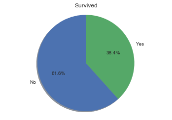


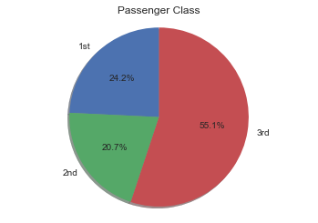


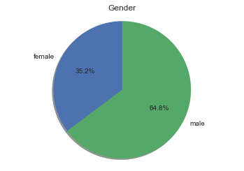


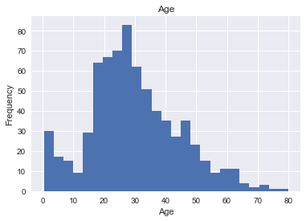


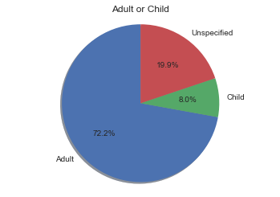


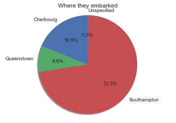


With these charts, we can have a general idea of the data:
* Most people on board died (61.6%), and the overall survival rate is 38.4%
* They were mostly using 3rd class accommodations
* 64.8% were male
* Only 8% were children (14 years old or younger), and we have a lot of missing age values! More on that below.
* And almost 3/4 of them (72.3%) embarked on the Southampton port

Interesting data overall, but it gets us nowhere in analyzing which variables led to statistic relevant advantages in survival, so let's dive deeper!

#### Missing values

We have a lot of missing values when talking about age, and just a few on where they embarked, let's take a closer look:


```python
data.isnull().sum()
```


    Survived             0
    Passenger Class      0
    Name                 0
    Gender               0
    Age                177
    SibSp                0
    Parch                0
    Ticket               0
    Fare                 0
    Cabin              687
    Embarked             2
    Adult or Child     177
    Family               0
    dtype: int64


* With just 2 rows missing data on where the passengers embarked, we can exclude these rows from our analysis without problems.

* Now the missing ages, and by consequence, the missing 'Adult or Child' values (177 out of 891) are going to have an impact on our analysis. We could use the mean to fill those values, but I think it would only create more uncertainties to the conclusions. So, I will be dropping theses rows too, but it is important to say that for this variable, the analysis will be prejudicated.

* Another important thing to say, is that we don't have the data pointing on whether each passenger is a crew member. This fact partially explains why our gender distribution is so uneven.

## Data Analysis

To answer the questions proposed on the beginning, we will need to write some hypotheses (H<sub>o</sub>: Null hypothesis; H<sub>a</sub>: Alternative hypothesis), have "Survival rate plots" of each independent variable, and compute the relevant statistics, so our conclusions can be supported.

### Did gender have an impact on the survival rate?

* H<sub>o</sub>: Gender did not have an impact on the survival rate. 
* H<sub>a</sub>: Gender did have an impact on the survival rate.

Alpha Level = 0.05


```python
observed, expected, total, interest, labels = values_for_plot(data, 'Gender')
plot_survival(observed, expected, total, interest, labels)
```


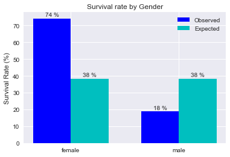


Well, judging by the chart, it did! But let's not get ahead of ourselves, we need statistics to back our hypothesis, and the test of choice is the Chi Square.
First, we need to compute our frequency table, so we can look if our data can pass the restrictions of this test, they are:

1. Avoid dependent observations
2. And if the dataset is a sample, we need 20 or more entries
3. Avoid small frequencies, must be 5 or more each

Let's start with the first one, to test this, we need to know if every row of our dataset represents a different person.
To test this, we can check if every name on the list is unique, if we find a non-unique name, we'll find the entries and use the other variables to test if they are different or not:


```python
len(data)
uniqueNames = np.count_nonzero(data['Name'].unique()) #counts every unique name
numberOfRows = len(data) #the total size of our dataset
print('Number of unique names: {}\nTotal number of rows: {}'.format(uniqueNames, numberOfRows))
```

    Number of unique names: 891
    Total number of rows: 891


Every name is unique, so every entry is unique, this test doesn't need to be repeated when analyzing the other variables.

Now the second restriction:


```python
numberOfRows = len(data['Gender'].dropna()) #we drop the NaN values to make sure we only count the data that is
                                            #being used in this particular analysis
print('Total number of samples (n): {}'.format(numberOfRows))
```

    Total number of samples (n): 891


More than enough!

To solve our last restriction, we'll need to create a frequency table:


```python
table, df = frequency_table(data, 'Gender')
df
```


<div>
<table border="1" class="dataframe">
  <thead>
    <tr style="text-align: right;">
      <th></th>
      <th>female</th>
      <th>male</th>
    </tr>
  </thead>
  <tbody>
    <tr>
      <th>Survived</th>
      <td>233</td>
      <td>109</td>
    </tr>
    <tr>
      <th>Died</th>
      <td>81</td>
      <td>468</td>
    </tr>
  </tbody>
</table>
</div>


Every frequency is greater than 5, and we have 2 x 2 table so we are ready for the Chi Square Goodness-of-fit test!


```python
chi2test(data, 'Gender')
```

    Chi Square Goodness-of-fit
        
    Chi Square Value: 260.71702016732104
    p-value: 1.1973570627755645e-58
    Degrees of Freedom: 1
    Phi: 0.5409359434469282


#### Conclusion: Did gender had an impact on the survival rate?

Yes, it most definitely did! Not only our chart shows a big difference between observed and expected survival rate, but out Chi Square statistic is 260.72. That means that this outcome had less than 1.197e-56 % chance of occurring at random, so we can reject the null. To further back our conclusion the Phi statistic is superior to 0.5, which indicates that gender had a large effect on survival rate:

(0.10 = small effect) (0.30 = medium effect) (0.50=large effect)

It's important to say, too that without the data on crew members, we can't refine this analysis any further!

### Did childen have higher survival rate than adults?

* H<sub>o</sub>: Childen did not have a different survival rate than adults. 
* H<sub>a</sub>: Childen did have a different survival rate than adults.

Alpha Level = 0.05


```python
observed, expected, total, interest, labels = values_for_plot(data, 'Adult or Child')
plot_survival(observed, expected, total, interest, labels)
```


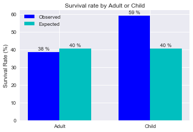


It appears so, but let's do a Chi Square Goodness-of-fit test to have a better understanding.
As we did before, we need to get the restrictions out of the way:

1. Avoid dependent observations
2. And if the dataset is a sample, we need 20 or more entries
3. Avoid small frequencies, must be 5 or more each

The first one was already solved before, so onto the second one:


```python
numberOfRows = len(data['Adult or Child'].dropna()) #we drop the NaN values to make sure we only count the data that is
                                                    #being used in this particular analysis
print('Total number of samples (n): {}'.format(numberOfRows))
```

    Total number of samples (n): 714


This time, the sample size is smaller, it is due to missing values in the 'Age' column of the original data, as we didn't have an age for some of the passengers, we have no choice but to exclude them from this part of the analysis.

And the last one:


```python
table, df = frequency_table(data, 'Adult or Child')
df
```


<div>
<table border="1" class="dataframe">
  <thead>
    <tr style="text-align: right;">
      <th></th>
      <th>Adult</th>
      <th>Child</th>
    </tr>
  </thead>
  <tbody>
    <tr>
      <th>Survived</th>
      <td>248</td>
      <td>42</td>
    </tr>
    <tr>
      <th>Died</th>
      <td>395</td>
      <td>29</td>
    </tr>
  </tbody>
</table>
</div>


We have enough frequency again, more than 5, so let's proceed with the test:


```python
chi2test(data, 'Adult or Child')
```

    Chi Square Goodness-of-fit
        
    Chi Square Value: 10.39675893095637
    p-value: 0.0012623669263000742
    Degrees of Freedom: 1
    Phi: 0.12067015794365306


#### Conclusion: Did children have higher survival rate than adults?
The Chi Square test shows us that being a child did have an effect on the survival rate, with these results having less than 0.13 % chance of occurring at random, so we can reject the null, but the Phi statistic, tells that the effect is as small one:
(0.10 = small effect) (0.30 = medium effect) (0.50=large effect)

* This test would be even more relevant if we didn't have to drop 177 row for missing age values. But I think this was the best way to proceed.

### Did the Passenger class (1st, 2nd, 3rd) had any effect?

* H<sub>o</sub>: Passenger Class did not have an impact on the survival rate. 
* H<sub>a</sub>: Passenger Class did have an impact on the survival rate.

Alpha Level = 0.05


```python
observed, expected, total, interest, labels = values_for_plot(data, 'Passenger Class')
plot_survival(observed, expected, total, interest, labels)
```


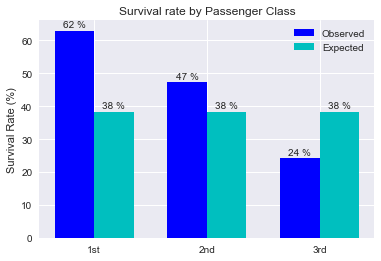


We have here some interesting results, it seems like it. Passengers from the 1st and 2nd class have a higher than average survival rate than the 3rd class.

Let's look into it with a Chi Square test, as soon as the restrictions are solved:


```python
numberOfRows = len(data['Passenger Class'].dropna()) #we drop the NaN values to make sure we only count the data that is
                                                    #being used in this particular analysis
print('Total number of samples (n): {}'.format(numberOfRows))
```

    Total number of samples (n): 891


```python
table, df = frequency_table(data, 'Passenger Class')
df
```


<div>
<table border="1" class="dataframe">
  <thead>
    <tr style="text-align: right;">
      <th></th>
      <th>1st</th>
      <th>2nd</th>
      <th>3rd</th>
    </tr>
  </thead>
  <tbody>
    <tr>
      <th>Survived</th>
      <td>136</td>
      <td>87</td>
      <td>119</td>
    </tr>
    <tr>
      <th>Died</th>
      <td>80</td>
      <td>97</td>
      <td>372</td>
    </tr>
  </tbody>
</table>
</div>


We're good to go! This time we have a 2 x 3 table, so let's do a Chi Square Test for Independence:


```python
chi2test(data, 'Passenger Class')
```

    Chi Square Test for Independence
        
    Chi Square Value: 102.88898875696057
    p-value: 4.5492517112987287e-23
    Degrees of Freedom: 2
    Cramér's V: 0.33981738800531175


#### Conclusion: Did the Passenger class (1st, 2nd, 3rd) had any effect?

Yes, it did. With a 102.89 Chi Square value we can conclude that the effect observed in the survival rate is not a random one (with a p-value of 4.549e-23 we can be "almost sure" of that), so we can reject the null. And the Cramér's V value of 0.34 tells us that the effect is a medium one, according to the Cohen's table for effect size:

k-1=1 (0.10 = small effect) (0.30 = medium effect) (0.50=large effect)

k-1=2 (0.07 = small effect) (0.21= medium effect) (0.35 = large effect)

k-1=3 (0.06 = small effect) (0.17 = medium effect) (0.29 = large effect)

### Did the unwritten law of Women and Children First (WCF) applied?

* H<sub>o</sub>: The WCF law did not apply (women and children had the same survival rate as men). 
* H<sub>a</sub>: The WCF law did apply (women and children had a different survival rate as men).

Alpha Level = 0.05

To answer this question, we will need to do some data wrangling, we need to create another column for our data that differentiate the passengers between man, woman and child:


```python
def label_gender_child(row):
    if row['Age'] < 14:
        return 'child'
    if row['Age'] >= 14 and row['Gender'] == 'male':
        return 'male'
    if row['Age'] >= 14 and row['Gender'] == 'female':
        return 'female'
    else:
        return np.NaN
data['Child, Male or Female'] = data.apply(lambda row: label_gender_child(row), axis=1)
data
```


<div>
<table border="1" class="dataframe">
  <thead>
    <tr style="text-align: right;">
      <th></th>
      <th>Survived</th>
      <th>Passenger Class</th>
      <th>Name</th>
      <th>Gender</th>
      <th>Age</th>
      <th>SibSp</th>
      <th>Parch</th>
      <th>Ticket</th>
      <th>Fare</th>
      <th>Cabin</th>
      <th>Embarked</th>
      <th>Adult or Child</th>
      <th>Family</th>
      <th>Child, Male or Female</th>
    </tr>
    <tr>
      <th>PassengerId</th>
      <th></th>
      <th></th>
      <th></th>
      <th></th>
      <th></th>
      <th></th>
      <th></th>
      <th></th>
      <th></th>
      <th></th>
      <th></th>
      <th></th>
      <th></th>
      <th></th>
    </tr>
  </thead>
  <tbody>
    <tr>
      <th>1</th>
      <td>0</td>
      <td>3rd</td>
      <td>Braund, Mr. Owen Harris</td>
      <td>male</td>
      <td>22.0</td>
      <td>1</td>
      <td>0</td>
      <td>A/5 21171</td>
      <td>7.2500</td>
      <td>NaN</td>
      <td>Southampton</td>
      <td>Adult</td>
      <td>Yes</td>
      <td>male</td>
    </tr>
    <tr>
      <th>2</th>
      <td>1</td>
      <td>1st</td>
      <td>Cumings, Mrs. John Bradley (Florence Briggs Th...</td>
      <td>female</td>
      <td>38.0</td>
      <td>1</td>
      <td>0</td>
      <td>PC 17599</td>
      <td>71.2833</td>
      <td>C85</td>
      <td>Cherbourg</td>
      <td>Adult</td>
      <td>Yes</td>
      <td>female</td>
    </tr>
    <tr>
      <th>3</th>
      <td>1</td>
      <td>3rd</td>
      <td>Heikkinen, Miss. Laina</td>
      <td>female</td>
      <td>26.0</td>
      <td>0</td>
      <td>0</td>
      <td>STON/O2. 3101282</td>
      <td>7.9250</td>
      <td>NaN</td>
      <td>Southampton</td>
      <td>Adult</td>
      <td>No</td>
      <td>female</td>
    </tr>
    <tr>
      <th>4</th>
      <td>1</td>
      <td>1st</td>
      <td>Futrelle, Mrs. Jacques Heath (Lily May Peel)</td>
      <td>female</td>
      <td>35.0</td>
      <td>1</td>
      <td>0</td>
      <td>113803</td>
      <td>53.1000</td>
      <td>C123</td>
      <td>Southampton</td>
      <td>Adult</td>
      <td>Yes</td>
      <td>female</td>
    </tr>
    <tr>
      <th>5</th>
      <td>0</td>
      <td>3rd</td>
      <td>Allen, Mr. William Henry</td>
      <td>male</td>
      <td>35.0</td>
      <td>0</td>
      <td>0</td>
      <td>373450</td>
      <td>8.0500</td>
      <td>NaN</td>
      <td>Southampton</td>
      <td>Adult</td>
      <td>No</td>
      <td>male</td>
    </tr>
    <tr>
      <th>6</th>
      <td>0</td>
      <td>3rd</td>
      <td>Moran, Mr. James</td>
      <td>male</td>
      <td>NaN</td>
      <td>0</td>
      <td>0</td>
      <td>330877</td>
      <td>8.4583</td>
      <td>NaN</td>
      <td>Queenstown</td>
      <td>NaN</td>
      <td>No</td>
      <td>NaN</td>
    </tr>
    <tr>
      <th>7</th>
      <td>0</td>
      <td>1st</td>
      <td>McCarthy, Mr. Timothy J</td>
      <td>male</td>
      <td>54.0</td>
      <td>0</td>
      <td>0</td>
      <td>17463</td>
      <td>51.8625</td>
      <td>E46</td>
      <td>Southampton</td>
      <td>Adult</td>
      <td>No</td>
      <td>male</td>
    </tr>
    <tr>
      <th>8</th>
      <td>0</td>
      <td>3rd</td>
      <td>Palsson, Master. Gosta Leonard</td>
      <td>male</td>
      <td>2.0</td>
      <td>3</td>
      <td>1</td>
      <td>349909</td>
      <td>21.0750</td>
      <td>NaN</td>
      <td>Southampton</td>
      <td>Child</td>
      <td>Yes</td>
      <td>child</td>
    </tr>
    <tr>
      <th>9</th>
      <td>1</td>
      <td>3rd</td>
      <td>Johnson, Mrs. Oscar W (Elisabeth Vilhelmina Berg)</td>
      <td>female</td>
      <td>27.0</td>
      <td>0</td>
      <td>2</td>
      <td>347742</td>
      <td>11.1333</td>
      <td>NaN</td>
      <td>Southampton</td>
      <td>Adult</td>
      <td>Yes</td>
      <td>female</td>
    </tr>
    <tr>
      <th>10</th>
      <td>1</td>
      <td>2nd</td>
      <td>Nasser, Mrs. Nicholas (Adele Achem)</td>
      <td>female</td>
      <td>14.0</td>
      <td>1</td>
      <td>0</td>
      <td>237736</td>
      <td>30.0708</td>
      <td>NaN</td>
      <td>Cherbourg</td>
      <td>Adult</td>
      <td>Yes</td>
      <td>female</td>
    </tr>
    <tr>
      <th>11</th>
      <td>1</td>
      <td>3rd</td>
      <td>Sandstrom, Miss. Marguerite Rut</td>
      <td>female</td>
      <td>4.0</td>
      <td>1</td>
      <td>1</td>
      <td>PP 9549</td>
      <td>16.7000</td>
      <td>G6</td>
      <td>Southampton</td>
      <td>Child</td>
      <td>Yes</td>
      <td>child</td>
    </tr>
    <tr>
      <th>12</th>
      <td>1</td>
      <td>1st</td>
      <td>Bonnell, Miss. Elizabeth</td>
      <td>female</td>
      <td>58.0</td>
      <td>0</td>
      <td>0</td>
      <td>113783</td>
      <td>26.5500</td>
      <td>C103</td>
      <td>Southampton</td>
      <td>Adult</td>
      <td>No</td>
      <td>female</td>
    </tr>
    <tr>
      <th>13</th>
      <td>0</td>
      <td>3rd</td>
      <td>Saundercock, Mr. William Henry</td>
      <td>male</td>
      <td>20.0</td>
      <td>0</td>
      <td>0</td>
      <td>A/5. 2151</td>
      <td>8.0500</td>
      <td>NaN</td>
      <td>Southampton</td>
      <td>Adult</td>
      <td>No</td>
      <td>male</td>
    </tr>
    <tr>
      <th>14</th>
      <td>0</td>
      <td>3rd</td>
      <td>Andersson, Mr. Anders Johan</td>
      <td>male</td>
      <td>39.0</td>
      <td>1</td>
      <td>5</td>
      <td>347082</td>
      <td>31.2750</td>
      <td>NaN</td>
      <td>Southampton</td>
      <td>Adult</td>
      <td>Yes</td>
      <td>male</td>
    </tr>
    <tr>
      <th>15</th>
      <td>0</td>
      <td>3rd</td>
      <td>Vestrom, Miss. Hulda Amanda Adolfina</td>
      <td>female</td>
      <td>14.0</td>
      <td>0</td>
      <td>0</td>
      <td>350406</td>
      <td>7.8542</td>
      <td>NaN</td>
      <td>Southampton</td>
      <td>Adult</td>
      <td>No</td>
      <td>female</td>
    </tr>
    <tr>
      <th>16</th>
      <td>1</td>
      <td>2nd</td>
      <td>Hewlett, Mrs. (Mary D Kingcome)</td>
      <td>female</td>
      <td>55.0</td>
      <td>0</td>
      <td>0</td>
      <td>248706</td>
      <td>16.0000</td>
      <td>NaN</td>
      <td>Southampton</td>
      <td>Adult</td>
      <td>No</td>
      <td>female</td>
    </tr>
    <tr>
      <th>17</th>
      <td>0</td>
      <td>3rd</td>
      <td>Rice, Master. Eugene</td>
      <td>male</td>
      <td>2.0</td>
      <td>4</td>
      <td>1</td>
      <td>382652</td>
      <td>29.1250</td>
      <td>NaN</td>
      <td>Queenstown</td>
      <td>Child</td>
      <td>Yes</td>
      <td>child</td>
    </tr>
    <tr>
      <th>18</th>
      <td>1</td>
      <td>2nd</td>
      <td>Williams, Mr. Charles Eugene</td>
      <td>male</td>
      <td>NaN</td>
      <td>0</td>
      <td>0</td>
      <td>244373</td>
      <td>13.0000</td>
      <td>NaN</td>
      <td>Southampton</td>
      <td>NaN</td>
      <td>No</td>
      <td>NaN</td>
    </tr>
    <tr>
      <th>19</th>
      <td>0</td>
      <td>3rd</td>
      <td>Vander Planke, Mrs. Julius (Emelia Maria Vande...</td>
      <td>female</td>
      <td>31.0</td>
      <td>1</td>
      <td>0</td>
      <td>345763</td>
      <td>18.0000</td>
      <td>NaN</td>
      <td>Southampton</td>
      <td>Adult</td>
      <td>Yes</td>
      <td>female</td>
    </tr>
    <tr>
      <th>20</th>
      <td>1</td>
      <td>3rd</td>
      <td>Masselmani, Mrs. Fatima</td>
      <td>female</td>
      <td>NaN</td>
      <td>0</td>
      <td>0</td>
      <td>2649</td>
      <td>7.2250</td>
      <td>NaN</td>
      <td>Cherbourg</td>
      <td>NaN</td>
      <td>No</td>
      <td>NaN</td>
    </tr>
    <tr>
      <th>21</th>
      <td>0</td>
      <td>2nd</td>
      <td>Fynney, Mr. Joseph J</td>
      <td>male</td>
      <td>35.0</td>
      <td>0</td>
      <td>0</td>
      <td>239865</td>
      <td>26.0000</td>
      <td>NaN</td>
      <td>Southampton</td>
      <td>Adult</td>
      <td>No</td>
      <td>male</td>
    </tr>
    <tr>
      <th>22</th>
      <td>1</td>
      <td>2nd</td>
      <td>Beesley, Mr. Lawrence</td>
      <td>male</td>
      <td>34.0</td>
      <td>0</td>
      <td>0</td>
      <td>248698</td>
      <td>13.0000</td>
      <td>D56</td>
      <td>Southampton</td>
      <td>Adult</td>
      <td>No</td>
      <td>male</td>
    </tr>
    <tr>
      <th>23</th>
      <td>1</td>
      <td>3rd</td>
      <td>McGowan, Miss. Anna "Annie"</td>
      <td>female</td>
      <td>15.0</td>
      <td>0</td>
      <td>0</td>
      <td>330923</td>
      <td>8.0292</td>
      <td>NaN</td>
      <td>Queenstown</td>
      <td>Adult</td>
      <td>No</td>
      <td>female</td>
    </tr>
    <tr>
      <th>24</th>
      <td>1</td>
      <td>1st</td>
      <td>Sloper, Mr. William Thompson</td>
      <td>male</td>
      <td>28.0</td>
      <td>0</td>
      <td>0</td>
      <td>113788</td>
      <td>35.5000</td>
      <td>A6</td>
      <td>Southampton</td>
      <td>Adult</td>
      <td>No</td>
      <td>male</td>
    </tr>
    <tr>
      <th>25</th>
      <td>0</td>
      <td>3rd</td>
      <td>Palsson, Miss. Torborg Danira</td>
      <td>female</td>
      <td>8.0</td>
      <td>3</td>
      <td>1</td>
      <td>349909</td>
      <td>21.0750</td>
      <td>NaN</td>
      <td>Southampton</td>
      <td>Child</td>
      <td>Yes</td>
      <td>child</td>
    </tr>
    <tr>
      <th>26</th>
      <td>1</td>
      <td>3rd</td>
      <td>Asplund, Mrs. Carl Oscar (Selma Augusta Emilia...</td>
      <td>female</td>
      <td>38.0</td>
      <td>1</td>
      <td>5</td>
      <td>347077</td>
      <td>31.3875</td>
      <td>NaN</td>
      <td>Southampton</td>
      <td>Adult</td>
      <td>Yes</td>
      <td>female</td>
    </tr>
    <tr>
      <th>27</th>
      <td>0</td>
      <td>3rd</td>
      <td>Emir, Mr. Farred Chehab</td>
      <td>male</td>
      <td>NaN</td>
      <td>0</td>
      <td>0</td>
      <td>2631</td>
      <td>7.2250</td>
      <td>NaN</td>
      <td>Cherbourg</td>
      <td>NaN</td>
      <td>No</td>
      <td>NaN</td>
    </tr>
    <tr>
      <th>28</th>
      <td>0</td>
      <td>1st</td>
      <td>Fortune, Mr. Charles Alexander</td>
      <td>male</td>
      <td>19.0</td>
      <td>3</td>
      <td>2</td>
      <td>19950</td>
      <td>263.0000</td>
      <td>C23 C25 C27</td>
      <td>Southampton</td>
      <td>Adult</td>
      <td>Yes</td>
      <td>male</td>
    </tr>
    <tr>
      <th>29</th>
      <td>1</td>
      <td>3rd</td>
      <td>O'Dwyer, Miss. Ellen "Nellie"</td>
      <td>female</td>
      <td>NaN</td>
      <td>0</td>
      <td>0</td>
      <td>330959</td>
      <td>7.8792</td>
      <td>NaN</td>
      <td>Queenstown</td>
      <td>NaN</td>
      <td>No</td>
      <td>NaN</td>
    </tr>
    <tr>
      <th>30</th>
      <td>0</td>
      <td>3rd</td>
      <td>Todoroff, Mr. Lalio</td>
      <td>male</td>
      <td>NaN</td>
      <td>0</td>
      <td>0</td>
      <td>349216</td>
      <td>7.8958</td>
      <td>NaN</td>
      <td>Southampton</td>
      <td>NaN</td>
      <td>No</td>
      <td>NaN</td>
    </tr>
    <tr>
      <th>...</th>
      <td>...</td>
      <td>...</td>
      <td>...</td>
      <td>...</td>
      <td>...</td>
      <td>...</td>
      <td>...</td>
      <td>...</td>
      <td>...</td>
      <td>...</td>
      <td>...</td>
      <td>...</td>
      <td>...</td>
      <td>...</td>
    </tr>
    <tr>
      <th>862</th>
      <td>0</td>
      <td>2nd</td>
      <td>Giles, Mr. Frederick Edward</td>
      <td>male</td>
      <td>21.0</td>
      <td>1</td>
      <td>0</td>
      <td>28134</td>
      <td>11.5000</td>
      <td>NaN</td>
      <td>Southampton</td>
      <td>Adult</td>
      <td>Yes</td>
      <td>male</td>
    </tr>
    <tr>
      <th>863</th>
      <td>1</td>
      <td>1st</td>
      <td>Swift, Mrs. Frederick Joel (Margaret Welles Ba...</td>
      <td>female</td>
      <td>48.0</td>
      <td>0</td>
      <td>0</td>
      <td>17466</td>
      <td>25.9292</td>
      <td>D17</td>
      <td>Southampton</td>
      <td>Adult</td>
      <td>No</td>
      <td>female</td>
    </tr>
    <tr>
      <th>864</th>
      <td>0</td>
      <td>3rd</td>
      <td>Sage, Miss. Dorothy Edith "Dolly"</td>
      <td>female</td>
      <td>NaN</td>
      <td>8</td>
      <td>2</td>
      <td>CA. 2343</td>
      <td>69.5500</td>
      <td>NaN</td>
      <td>Southampton</td>
      <td>NaN</td>
      <td>Yes</td>
      <td>NaN</td>
    </tr>
    <tr>
      <th>865</th>
      <td>0</td>
      <td>2nd</td>
      <td>Gill, Mr. John William</td>
      <td>male</td>
      <td>24.0</td>
      <td>0</td>
      <td>0</td>
      <td>233866</td>
      <td>13.0000</td>
      <td>NaN</td>
      <td>Southampton</td>
      <td>Adult</td>
      <td>No</td>
      <td>male</td>
    </tr>
    <tr>
      <th>866</th>
      <td>1</td>
      <td>2nd</td>
      <td>Bystrom, Mrs. (Karolina)</td>
      <td>female</td>
      <td>42.0</td>
      <td>0</td>
      <td>0</td>
      <td>236852</td>
      <td>13.0000</td>
      <td>NaN</td>
      <td>Southampton</td>
      <td>Adult</td>
      <td>No</td>
      <td>female</td>
    </tr>
    <tr>
      <th>867</th>
      <td>1</td>
      <td>2nd</td>
      <td>Duran y More, Miss. Asuncion</td>
      <td>female</td>
      <td>27.0</td>
      <td>1</td>
      <td>0</td>
      <td>SC/PARIS 2149</td>
      <td>13.8583</td>
      <td>NaN</td>
      <td>Cherbourg</td>
      <td>Adult</td>
      <td>Yes</td>
      <td>female</td>
    </tr>
    <tr>
      <th>868</th>
      <td>0</td>
      <td>1st</td>
      <td>Roebling, Mr. Washington Augustus II</td>
      <td>male</td>
      <td>31.0</td>
      <td>0</td>
      <td>0</td>
      <td>PC 17590</td>
      <td>50.4958</td>
      <td>A24</td>
      <td>Southampton</td>
      <td>Adult</td>
      <td>No</td>
      <td>male</td>
    </tr>
    <tr>
      <th>869</th>
      <td>0</td>
      <td>3rd</td>
      <td>van Melkebeke, Mr. Philemon</td>
      <td>male</td>
      <td>NaN</td>
      <td>0</td>
      <td>0</td>
      <td>345777</td>
      <td>9.5000</td>
      <td>NaN</td>
      <td>Southampton</td>
      <td>NaN</td>
      <td>No</td>
      <td>NaN</td>
    </tr>
    <tr>
      <th>870</th>
      <td>1</td>
      <td>3rd</td>
      <td>Johnson, Master. Harold Theodor</td>
      <td>male</td>
      <td>4.0</td>
      <td>1</td>
      <td>1</td>
      <td>347742</td>
      <td>11.1333</td>
      <td>NaN</td>
      <td>Southampton</td>
      <td>Child</td>
      <td>Yes</td>
      <td>child</td>
    </tr>
    <tr>
      <th>871</th>
      <td>0</td>
      <td>3rd</td>
      <td>Balkic, Mr. Cerin</td>
      <td>male</td>
      <td>26.0</td>
      <td>0</td>
      <td>0</td>
      <td>349248</td>
      <td>7.8958</td>
      <td>NaN</td>
      <td>Southampton</td>
      <td>Adult</td>
      <td>No</td>
      <td>male</td>
    </tr>
    <tr>
      <th>872</th>
      <td>1</td>
      <td>1st</td>
      <td>Beckwith, Mrs. Richard Leonard (Sallie Monypeny)</td>
      <td>female</td>
      <td>47.0</td>
      <td>1</td>
      <td>1</td>
      <td>11751</td>
      <td>52.5542</td>
      <td>D35</td>
      <td>Southampton</td>
      <td>Adult</td>
      <td>Yes</td>
      <td>female</td>
    </tr>
    <tr>
      <th>873</th>
      <td>0</td>
      <td>1st</td>
      <td>Carlsson, Mr. Frans Olof</td>
      <td>male</td>
      <td>33.0</td>
      <td>0</td>
      <td>0</td>
      <td>695</td>
      <td>5.0000</td>
      <td>B51 B53 B55</td>
      <td>Southampton</td>
      <td>Adult</td>
      <td>No</td>
      <td>male</td>
    </tr>
    <tr>
      <th>874</th>
      <td>0</td>
      <td>3rd</td>
      <td>Vander Cruyssen, Mr. Victor</td>
      <td>male</td>
      <td>47.0</td>
      <td>0</td>
      <td>0</td>
      <td>345765</td>
      <td>9.0000</td>
      <td>NaN</td>
      <td>Southampton</td>
      <td>Adult</td>
      <td>No</td>
      <td>male</td>
    </tr>
    <tr>
      <th>875</th>
      <td>1</td>
      <td>2nd</td>
      <td>Abelson, Mrs. Samuel (Hannah Wizosky)</td>
      <td>female</td>
      <td>28.0</td>
      <td>1</td>
      <td>0</td>
      <td>P/PP 3381</td>
      <td>24.0000</td>
      <td>NaN</td>
      <td>Cherbourg</td>
      <td>Adult</td>
      <td>Yes</td>
      <td>female</td>
    </tr>
    <tr>
      <th>876</th>
      <td>1</td>
      <td>3rd</td>
      <td>Najib, Miss. Adele Kiamie "Jane"</td>
      <td>female</td>
      <td>15.0</td>
      <td>0</td>
      <td>0</td>
      <td>2667</td>
      <td>7.2250</td>
      <td>NaN</td>
      <td>Cherbourg</td>
      <td>Adult</td>
      <td>No</td>
      <td>female</td>
    </tr>
    <tr>
      <th>877</th>
      <td>0</td>
      <td>3rd</td>
      <td>Gustafsson, Mr. Alfred Ossian</td>
      <td>male</td>
      <td>20.0</td>
      <td>0</td>
      <td>0</td>
      <td>7534</td>
      <td>9.8458</td>
      <td>NaN</td>
      <td>Southampton</td>
      <td>Adult</td>
      <td>No</td>
      <td>male</td>
    </tr>
    <tr>
      <th>878</th>
      <td>0</td>
      <td>3rd</td>
      <td>Petroff, Mr. Nedelio</td>
      <td>male</td>
      <td>19.0</td>
      <td>0</td>
      <td>0</td>
      <td>349212</td>
      <td>7.8958</td>
      <td>NaN</td>
      <td>Southampton</td>
      <td>Adult</td>
      <td>No</td>
      <td>male</td>
    </tr>
    <tr>
      <th>879</th>
      <td>0</td>
      <td>3rd</td>
      <td>Laleff, Mr. Kristo</td>
      <td>male</td>
      <td>NaN</td>
      <td>0</td>
      <td>0</td>
      <td>349217</td>
      <td>7.8958</td>
      <td>NaN</td>
      <td>Southampton</td>
      <td>NaN</td>
      <td>No</td>
      <td>NaN</td>
    </tr>
    <tr>
      <th>880</th>
      <td>1</td>
      <td>1st</td>
      <td>Potter, Mrs. Thomas Jr (Lily Alexenia Wilson)</td>
      <td>female</td>
      <td>56.0</td>
      <td>0</td>
      <td>1</td>
      <td>11767</td>
      <td>83.1583</td>
      <td>C50</td>
      <td>Cherbourg</td>
      <td>Adult</td>
      <td>Yes</td>
      <td>female</td>
    </tr>
    <tr>
      <th>881</th>
      <td>1</td>
      <td>2nd</td>
      <td>Shelley, Mrs. William (Imanita Parrish Hall)</td>
      <td>female</td>
      <td>25.0</td>
      <td>0</td>
      <td>1</td>
      <td>230433</td>
      <td>26.0000</td>
      <td>NaN</td>
      <td>Southampton</td>
      <td>Adult</td>
      <td>Yes</td>
      <td>female</td>
    </tr>
    <tr>
      <th>882</th>
      <td>0</td>
      <td>3rd</td>
      <td>Markun, Mr. Johann</td>
      <td>male</td>
      <td>33.0</td>
      <td>0</td>
      <td>0</td>
      <td>349257</td>
      <td>7.8958</td>
      <td>NaN</td>
      <td>Southampton</td>
      <td>Adult</td>
      <td>No</td>
      <td>male</td>
    </tr>
    <tr>
      <th>883</th>
      <td>0</td>
      <td>3rd</td>
      <td>Dahlberg, Miss. Gerda Ulrika</td>
      <td>female</td>
      <td>22.0</td>
      <td>0</td>
      <td>0</td>
      <td>7552</td>
      <td>10.5167</td>
      <td>NaN</td>
      <td>Southampton</td>
      <td>Adult</td>
      <td>No</td>
      <td>female</td>
    </tr>
    <tr>
      <th>884</th>
      <td>0</td>
      <td>2nd</td>
      <td>Banfield, Mr. Frederick James</td>
      <td>male</td>
      <td>28.0</td>
      <td>0</td>
      <td>0</td>
      <td>C.A./SOTON 34068</td>
      <td>10.5000</td>
      <td>NaN</td>
      <td>Southampton</td>
      <td>Adult</td>
      <td>No</td>
      <td>male</td>
    </tr>
    <tr>
      <th>885</th>
      <td>0</td>
      <td>3rd</td>
      <td>Sutehall, Mr. Henry Jr</td>
      <td>male</td>
      <td>25.0</td>
      <td>0</td>
      <td>0</td>
      <td>SOTON/OQ 392076</td>
      <td>7.0500</td>
      <td>NaN</td>
      <td>Southampton</td>
      <td>Adult</td>
      <td>No</td>
      <td>male</td>
    </tr>
    <tr>
      <th>886</th>
      <td>0</td>
      <td>3rd</td>
      <td>Rice, Mrs. William (Margaret Norton)</td>
      <td>female</td>
      <td>39.0</td>
      <td>0</td>
      <td>5</td>
      <td>382652</td>
      <td>29.1250</td>
      <td>NaN</td>
      <td>Queenstown</td>
      <td>Adult</td>
      <td>Yes</td>
      <td>female</td>
    </tr>
    <tr>
      <th>887</th>
      <td>0</td>
      <td>2nd</td>
      <td>Montvila, Rev. Juozas</td>
      <td>male</td>
      <td>27.0</td>
      <td>0</td>
      <td>0</td>
      <td>211536</td>
      <td>13.0000</td>
      <td>NaN</td>
      <td>Southampton</td>
      <td>Adult</td>
      <td>No</td>
      <td>male</td>
    </tr>
    <tr>
      <th>888</th>
      <td>1</td>
      <td>1st</td>
      <td>Graham, Miss. Margaret Edith</td>
      <td>female</td>
      <td>19.0</td>
      <td>0</td>
      <td>0</td>
      <td>112053</td>
      <td>30.0000</td>
      <td>B42</td>
      <td>Southampton</td>
      <td>Adult</td>
      <td>No</td>
      <td>female</td>
    </tr>
    <tr>
      <th>889</th>
      <td>0</td>
      <td>3rd</td>
      <td>Johnston, Miss. Catherine Helen "Carrie"</td>
      <td>female</td>
      <td>NaN</td>
      <td>1</td>
      <td>2</td>
      <td>W./C. 6607</td>
      <td>23.4500</td>
      <td>NaN</td>
      <td>Southampton</td>
      <td>NaN</td>
      <td>Yes</td>
      <td>NaN</td>
    </tr>
    <tr>
      <th>890</th>
      <td>1</td>
      <td>1st</td>
      <td>Behr, Mr. Karl Howell</td>
      <td>male</td>
      <td>26.0</td>
      <td>0</td>
      <td>0</td>
      <td>111369</td>
      <td>30.0000</td>
      <td>C148</td>
      <td>Cherbourg</td>
      <td>Adult</td>
      <td>No</td>
      <td>male</td>
    </tr>
    <tr>
      <th>891</th>
      <td>0</td>
      <td>3rd</td>
      <td>Dooley, Mr. Patrick</td>
      <td>male</td>
      <td>32.0</td>
      <td>0</td>
      <td>0</td>
      <td>370376</td>
      <td>7.7500</td>
      <td>NaN</td>
      <td>Queenstown</td>
      <td>Adult</td>
      <td>No</td>
      <td>male</td>
    </tr>
  </tbody>
</table>
<p>891 rows × 14 columns</p>
</div>


Looks good! As we already took care of all the precautions for a Chi Square tests we don't need to do it again.

So, we'll dive right in, plot a chart, and do a Chi Square Test for independence:


```python
observed, expected, total, interest, labels = values_for_plot(data, 'Child, Male or Female')
plot_survival(observed, expected, total, interest, labels)
```


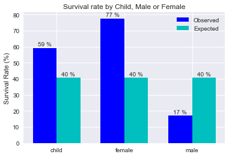


```python
chi2test(data, 'Child, Male or Female')
```

    Chi Square Test for Independence
        
    Chi Square Value: 232.08505943213527
    p-value: 4.0120808688093735e-51
    Degrees of Freedom: 2
    Cramér's V: 0.5701307769679934


#### Conclusion: Did the unwritten law of Women and Children First (WCF) applied?

As expected we can conclude that WCF law worked.
With about a 4.012e-49 % chance of these results not being random, so we can reject the null, and a strong effect size as per Cohen's table (Cramér's V: 0.57).

* This test would be even more relevant if we didn't have to drop 177 row for missing age values. But I think this was the best way to proceed. And, if we could filter the data for crew members, we'd have a better idea if the crew preferred to save themselves or the passengers!

### Did having family on board made any difference?

* H<sub>o</sub>: Having family on board did not make any difference in the survival rate. 
* H<sub>a</sub>: Having family on board did make a difference in the survival rate.

Alpha Level = 0.05


```python
observed, expected, total, interest, labels = values_for_plot(data, 'Family')
plot_survival(observed, expected, total, interest, labels, 'having or not family on board')
```


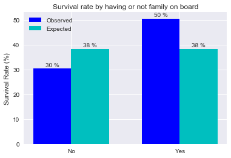


It seems like having family on board made a difference!
Let's see if it is statistically relevant, but first let's see if we can use Chi Square:


```python
numberOfRows = len(data['Family'].dropna()) #we drop the NaN values to make sure we only count the data that is
                                                    #being used in this particular analysis
print('Total number of samples (n): {}'.format(numberOfRows))
```

    Total number of samples (n): 891


```python
table, df = frequency_table(data, 'Family')
df
```


<div>
<table border="1" class="dataframe">
  <thead>
    <tr style="text-align: right;">
      <th></th>
      <th>No</th>
      <th>Yes</th>
    </tr>
  </thead>
  <tbody>
    <tr>
      <th>Survived</th>
      <td>163</td>
      <td>179</td>
    </tr>
    <tr>
      <th>Died</th>
      <td>374</td>
      <td>175</td>
    </tr>
  </tbody>
</table>
</div>


Yes, we can. So, without further delay, our Chi Square Goodness of fit test:


```python
chi2test(data, 'Family')
```

    Chi Square Goodness-of-fit
        
    Chi Square Value: 36.00051446773865
    p-value: 1.9726543846517113e-09
    Degrees of Freedom: 1
    Phi: 0.20100899932318905


#### Conclusion: Did having family on board made any difference?

It did. With a Chi Square Value of 36, and a p-value of 1.9726e-09 these values most definitely not random, so we can reject the null. 
And with a Phi statistic of 0.20 the effect size is between a small (0.10) and a medium (0.3) one.

### Did where they embarked affected their survival rate?


* H<sub>o</sub>: Where they embarked did not affect their survival rate. 
* H<sub>a</sub>: Where they embarked affected their survival rate.

Alpha Level = 0.05

This last question is highly unlikely to be true, but, as we have the data let's look into it:


```python
observed, expected, total, interest, labels = values_for_plot(data, 'Embarked')
plot_survival(observed, expected, total, interest, labels, 'where they embarked')
```


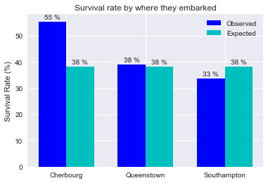


Whoa, not what I was expecting! We'll do a Chi Square test to see if it is statistically relevant.

Let's take the restrictions out of the way:


```python
numberOfRows = len(data['Embarked'].dropna()) #we drop the NaN values to make sure we only count the data that is
                                                    #being used in this particular analysis
print('Total number of samples (n): {}'.format(numberOfRows))
table, df = frequency_table(data, 'Embarked')
df
```

    Total number of samples (n): 889


<div>
<table border="1" class="dataframe">
  <thead>
    <tr style="text-align: right;">
      <th></th>
      <th>Cherbourg</th>
      <th>Queenstown</th>
      <th>Southampton</th>
    </tr>
  </thead>
  <tbody>
    <tr>
      <th>Survived</th>
      <td>93</td>
      <td>30</td>
      <td>217</td>
    </tr>
    <tr>
      <th>Died</th>
      <td>75</td>
      <td>47</td>
      <td>427</td>
    </tr>
  </tbody>
</table>
</div>


Looks good, let's preceed with the Chi Square Test for Independence:


```python
chi2test(data, 'Embarked')
```

    Chi Square Test for Independence
        
    Chi Square Value: 26.48914983923762
    p-value: 1.769922284120912e-06
    Degrees of Freedom: 2
    Cramér's V: 0.17261682709984438


With these results, we can reject the null, and even say that where the passengers embarked did have a small (0.10) to moderate (0.30) effect size on whether or not they survived.

But it doesn't make sense! "Correlation doesn't mean causation"! So, let's take a closer look on the passengers who embarked on Cherbourg:


```python
datac = data.loc[data['Embarked']=='Cherbourg'] #this creates a dataset of only the passengers whe embarked in Cherbourg
datac
```


<div>
<table border="1" class="dataframe">
  <thead>
    <tr style="text-align: right;">
      <th></th>
      <th>Survived</th>
      <th>Passenger Class</th>
      <th>Name</th>
      <th>Gender</th>
      <th>Age</th>
      <th>SibSp</th>
      <th>Parch</th>
      <th>Ticket</th>
      <th>Fare</th>
      <th>Cabin</th>
      <th>Embarked</th>
      <th>Adult or Child</th>
      <th>Family</th>
      <th>Child, Male or Female</th>
    </tr>
    <tr>
      <th>PassengerId</th>
      <th></th>
      <th></th>
      <th></th>
      <th></th>
      <th></th>
      <th></th>
      <th></th>
      <th></th>
      <th></th>
      <th></th>
      <th></th>
      <th></th>
      <th></th>
      <th></th>
    </tr>
  </thead>
  <tbody>
    <tr>
      <th>2</th>
      <td>1</td>
      <td>1st</td>
      <td>Cumings, Mrs. John Bradley (Florence Briggs Th...</td>
      <td>female</td>
      <td>38.00</td>
      <td>1</td>
      <td>0</td>
      <td>PC 17599</td>
      <td>71.2833</td>
      <td>C85</td>
      <td>Cherbourg</td>
      <td>Adult</td>
      <td>Yes</td>
      <td>female</td>
    </tr>
    <tr>
      <th>10</th>
      <td>1</td>
      <td>2nd</td>
      <td>Nasser, Mrs. Nicholas (Adele Achem)</td>
      <td>female</td>
      <td>14.00</td>
      <td>1</td>
      <td>0</td>
      <td>237736</td>
      <td>30.0708</td>
      <td>NaN</td>
      <td>Cherbourg</td>
      <td>Adult</td>
      <td>Yes</td>
      <td>female</td>
    </tr>
    <tr>
      <th>20</th>
      <td>1</td>
      <td>3rd</td>
      <td>Masselmani, Mrs. Fatima</td>
      <td>female</td>
      <td>NaN</td>
      <td>0</td>
      <td>0</td>
      <td>2649</td>
      <td>7.2250</td>
      <td>NaN</td>
      <td>Cherbourg</td>
      <td>NaN</td>
      <td>No</td>
      <td>NaN</td>
    </tr>
    <tr>
      <th>27</th>
      <td>0</td>
      <td>3rd</td>
      <td>Emir, Mr. Farred Chehab</td>
      <td>male</td>
      <td>NaN</td>
      <td>0</td>
      <td>0</td>
      <td>2631</td>
      <td>7.2250</td>
      <td>NaN</td>
      <td>Cherbourg</td>
      <td>NaN</td>
      <td>No</td>
      <td>NaN</td>
    </tr>
    <tr>
      <th>31</th>
      <td>0</td>
      <td>1st</td>
      <td>Uruchurtu, Don. Manuel E</td>
      <td>male</td>
      <td>40.00</td>
      <td>0</td>
      <td>0</td>
      <td>PC 17601</td>
      <td>27.7208</td>
      <td>NaN</td>
      <td>Cherbourg</td>
      <td>Adult</td>
      <td>No</td>
      <td>male</td>
    </tr>
    <tr>
      <th>32</th>
      <td>1</td>
      <td>1st</td>
      <td>Spencer, Mrs. William Augustus (Marie Eugenie)</td>
      <td>female</td>
      <td>NaN</td>
      <td>1</td>
      <td>0</td>
      <td>PC 17569</td>
      <td>146.5208</td>
      <td>B78</td>
      <td>Cherbourg</td>
      <td>NaN</td>
      <td>Yes</td>
      <td>NaN</td>
    </tr>
    <tr>
      <th>35</th>
      <td>0</td>
      <td>1st</td>
      <td>Meyer, Mr. Edgar Joseph</td>
      <td>male</td>
      <td>28.00</td>
      <td>1</td>
      <td>0</td>
      <td>PC 17604</td>
      <td>82.1708</td>
      <td>NaN</td>
      <td>Cherbourg</td>
      <td>Adult</td>
      <td>Yes</td>
      <td>male</td>
    </tr>
    <tr>
      <th>37</th>
      <td>1</td>
      <td>3rd</td>
      <td>Mamee, Mr. Hanna</td>
      <td>male</td>
      <td>NaN</td>
      <td>0</td>
      <td>0</td>
      <td>2677</td>
      <td>7.2292</td>
      <td>NaN</td>
      <td>Cherbourg</td>
      <td>NaN</td>
      <td>No</td>
      <td>NaN</td>
    </tr>
    <tr>
      <th>40</th>
      <td>1</td>
      <td>3rd</td>
      <td>Nicola-Yarred, Miss. Jamila</td>
      <td>female</td>
      <td>14.00</td>
      <td>1</td>
      <td>0</td>
      <td>2651</td>
      <td>11.2417</td>
      <td>NaN</td>
      <td>Cherbourg</td>
      <td>Adult</td>
      <td>Yes</td>
      <td>female</td>
    </tr>
    <tr>
      <th>43</th>
      <td>0</td>
      <td>3rd</td>
      <td>Kraeff, Mr. Theodor</td>
      <td>male</td>
      <td>NaN</td>
      <td>0</td>
      <td>0</td>
      <td>349253</td>
      <td>7.8958</td>
      <td>NaN</td>
      <td>Cherbourg</td>
      <td>NaN</td>
      <td>No</td>
      <td>NaN</td>
    </tr>
    <tr>
      <th>44</th>
      <td>1</td>
      <td>2nd</td>
      <td>Laroche, Miss. Simonne Marie Anne Andree</td>
      <td>female</td>
      <td>3.00</td>
      <td>1</td>
      <td>2</td>
      <td>SC/Paris 2123</td>
      <td>41.5792</td>
      <td>NaN</td>
      <td>Cherbourg</td>
      <td>Child</td>
      <td>Yes</td>
      <td>child</td>
    </tr>
    <tr>
      <th>49</th>
      <td>0</td>
      <td>3rd</td>
      <td>Samaan, Mr. Youssef</td>
      <td>male</td>
      <td>NaN</td>
      <td>2</td>
      <td>0</td>
      <td>2662</td>
      <td>21.6792</td>
      <td>NaN</td>
      <td>Cherbourg</td>
      <td>NaN</td>
      <td>Yes</td>
      <td>NaN</td>
    </tr>
    <tr>
      <th>53</th>
      <td>1</td>
      <td>1st</td>
      <td>Harper, Mrs. Henry Sleeper (Myna Haxtun)</td>
      <td>female</td>
      <td>49.00</td>
      <td>1</td>
      <td>0</td>
      <td>PC 17572</td>
      <td>76.7292</td>
      <td>D33</td>
      <td>Cherbourg</td>
      <td>Adult</td>
      <td>Yes</td>
      <td>female</td>
    </tr>
    <tr>
      <th>55</th>
      <td>0</td>
      <td>1st</td>
      <td>Ostby, Mr. Engelhart Cornelius</td>
      <td>male</td>
      <td>65.00</td>
      <td>0</td>
      <td>1</td>
      <td>113509</td>
      <td>61.9792</td>
      <td>B30</td>
      <td>Cherbourg</td>
      <td>Adult</td>
      <td>Yes</td>
      <td>male</td>
    </tr>
    <tr>
      <th>58</th>
      <td>0</td>
      <td>3rd</td>
      <td>Novel, Mr. Mansouer</td>
      <td>male</td>
      <td>28.50</td>
      <td>0</td>
      <td>0</td>
      <td>2697</td>
      <td>7.2292</td>
      <td>NaN</td>
      <td>Cherbourg</td>
      <td>Adult</td>
      <td>No</td>
      <td>male</td>
    </tr>
    <tr>
      <th>61</th>
      <td>0</td>
      <td>3rd</td>
      <td>Sirayanian, Mr. Orsen</td>
      <td>male</td>
      <td>22.00</td>
      <td>0</td>
      <td>0</td>
      <td>2669</td>
      <td>7.2292</td>
      <td>NaN</td>
      <td>Cherbourg</td>
      <td>Adult</td>
      <td>No</td>
      <td>male</td>
    </tr>
    <tr>
      <th>65</th>
      <td>0</td>
      <td>1st</td>
      <td>Stewart, Mr. Albert A</td>
      <td>male</td>
      <td>NaN</td>
      <td>0</td>
      <td>0</td>
      <td>PC 17605</td>
      <td>27.7208</td>
      <td>NaN</td>
      <td>Cherbourg</td>
      <td>NaN</td>
      <td>No</td>
      <td>NaN</td>
    </tr>
    <tr>
      <th>66</th>
      <td>1</td>
      <td>3rd</td>
      <td>Moubarek, Master. Gerios</td>
      <td>male</td>
      <td>NaN</td>
      <td>1</td>
      <td>1</td>
      <td>2661</td>
      <td>15.2458</td>
      <td>NaN</td>
      <td>Cherbourg</td>
      <td>NaN</td>
      <td>Yes</td>
      <td>NaN</td>
    </tr>
    <tr>
      <th>74</th>
      <td>0</td>
      <td>3rd</td>
      <td>Chronopoulos, Mr. Apostolos</td>
      <td>male</td>
      <td>26.00</td>
      <td>1</td>
      <td>0</td>
      <td>2680</td>
      <td>14.4542</td>
      <td>NaN</td>
      <td>Cherbourg</td>
      <td>Adult</td>
      <td>Yes</td>
      <td>male</td>
    </tr>
    <tr>
      <th>97</th>
      <td>0</td>
      <td>1st</td>
      <td>Goldschmidt, Mr. George B</td>
      <td>male</td>
      <td>71.00</td>
      <td>0</td>
      <td>0</td>
      <td>PC 17754</td>
      <td>34.6542</td>
      <td>A5</td>
      <td>Cherbourg</td>
      <td>Adult</td>
      <td>No</td>
      <td>male</td>
    </tr>
    <tr>
      <th>98</th>
      <td>1</td>
      <td>1st</td>
      <td>Greenfield, Mr. William Bertram</td>
      <td>male</td>
      <td>23.00</td>
      <td>0</td>
      <td>1</td>
      <td>PC 17759</td>
      <td>63.3583</td>
      <td>D10 D12</td>
      <td>Cherbourg</td>
      <td>Adult</td>
      <td>Yes</td>
      <td>male</td>
    </tr>
    <tr>
      <th>112</th>
      <td>0</td>
      <td>3rd</td>
      <td>Zabour, Miss. Hileni</td>
      <td>female</td>
      <td>14.50</td>
      <td>1</td>
      <td>0</td>
      <td>2665</td>
      <td>14.4542</td>
      <td>NaN</td>
      <td>Cherbourg</td>
      <td>Adult</td>
      <td>Yes</td>
      <td>female</td>
    </tr>
    <tr>
      <th>115</th>
      <td>0</td>
      <td>3rd</td>
      <td>Attalah, Miss. Malake</td>
      <td>female</td>
      <td>17.00</td>
      <td>0</td>
      <td>0</td>
      <td>2627</td>
      <td>14.4583</td>
      <td>NaN</td>
      <td>Cherbourg</td>
      <td>Adult</td>
      <td>No</td>
      <td>female</td>
    </tr>
    <tr>
      <th>119</th>
      <td>0</td>
      <td>1st</td>
      <td>Baxter, Mr. Quigg Edmond</td>
      <td>male</td>
      <td>24.00</td>
      <td>0</td>
      <td>1</td>
      <td>PC 17558</td>
      <td>247.5208</td>
      <td>B58 B60</td>
      <td>Cherbourg</td>
      <td>Adult</td>
      <td>Yes</td>
      <td>male</td>
    </tr>
    <tr>
      <th>123</th>
      <td>0</td>
      <td>2nd</td>
      <td>Nasser, Mr. Nicholas</td>
      <td>male</td>
      <td>32.50</td>
      <td>1</td>
      <td>0</td>
      <td>237736</td>
      <td>30.0708</td>
      <td>NaN</td>
      <td>Cherbourg</td>
      <td>Adult</td>
      <td>Yes</td>
      <td>male</td>
    </tr>
    <tr>
      <th>126</th>
      <td>1</td>
      <td>3rd</td>
      <td>Nicola-Yarred, Master. Elias</td>
      <td>male</td>
      <td>12.00</td>
      <td>1</td>
      <td>0</td>
      <td>2651</td>
      <td>11.2417</td>
      <td>NaN</td>
      <td>Cherbourg</td>
      <td>Child</td>
      <td>Yes</td>
      <td>child</td>
    </tr>
    <tr>
      <th>129</th>
      <td>1</td>
      <td>3rd</td>
      <td>Peter, Miss. Anna</td>
      <td>female</td>
      <td>NaN</td>
      <td>1</td>
      <td>1</td>
      <td>2668</td>
      <td>22.3583</td>
      <td>F E69</td>
      <td>Cherbourg</td>
      <td>NaN</td>
      <td>Yes</td>
      <td>NaN</td>
    </tr>
    <tr>
      <th>131</th>
      <td>0</td>
      <td>3rd</td>
      <td>Drazenoic, Mr. Jozef</td>
      <td>male</td>
      <td>33.00</td>
      <td>0</td>
      <td>0</td>
      <td>349241</td>
      <td>7.8958</td>
      <td>NaN</td>
      <td>Cherbourg</td>
      <td>Adult</td>
      <td>No</td>
      <td>male</td>
    </tr>
    <tr>
      <th>136</th>
      <td>0</td>
      <td>2nd</td>
      <td>Richard, Mr. Emile</td>
      <td>male</td>
      <td>23.00</td>
      <td>0</td>
      <td>0</td>
      <td>SC/PARIS 2133</td>
      <td>15.0458</td>
      <td>NaN</td>
      <td>Cherbourg</td>
      <td>Adult</td>
      <td>No</td>
      <td>male</td>
    </tr>
    <tr>
      <th>140</th>
      <td>0</td>
      <td>1st</td>
      <td>Giglio, Mr. Victor</td>
      <td>male</td>
      <td>24.00</td>
      <td>0</td>
      <td>0</td>
      <td>PC 17593</td>
      <td>79.2000</td>
      <td>B86</td>
      <td>Cherbourg</td>
      <td>Adult</td>
      <td>No</td>
      <td>male</td>
    </tr>
    <tr>
      <th>...</th>
      <td>...</td>
      <td>...</td>
      <td>...</td>
      <td>...</td>
      <td>...</td>
      <td>...</td>
      <td>...</td>
      <td>...</td>
      <td>...</td>
      <td>...</td>
      <td>...</td>
      <td>...</td>
      <td>...</td>
      <td>...</td>
    </tr>
    <tr>
      <th>717</th>
      <td>1</td>
      <td>1st</td>
      <td>Endres, Miss. Caroline Louise</td>
      <td>female</td>
      <td>38.00</td>
      <td>0</td>
      <td>0</td>
      <td>PC 17757</td>
      <td>227.5250</td>
      <td>C45</td>
      <td>Cherbourg</td>
      <td>Adult</td>
      <td>No</td>
      <td>female</td>
    </tr>
    <tr>
      <th>732</th>
      <td>0</td>
      <td>3rd</td>
      <td>Hassan, Mr. Houssein G N</td>
      <td>male</td>
      <td>11.00</td>
      <td>0</td>
      <td>0</td>
      <td>2699</td>
      <td>18.7875</td>
      <td>NaN</td>
      <td>Cherbourg</td>
      <td>Child</td>
      <td>No</td>
      <td>child</td>
    </tr>
    <tr>
      <th>738</th>
      <td>1</td>
      <td>1st</td>
      <td>Lesurer, Mr. Gustave J</td>
      <td>male</td>
      <td>35.00</td>
      <td>0</td>
      <td>0</td>
      <td>PC 17755</td>
      <td>512.3292</td>
      <td>B101</td>
      <td>Cherbourg</td>
      <td>Adult</td>
      <td>No</td>
      <td>male</td>
    </tr>
    <tr>
      <th>743</th>
      <td>1</td>
      <td>1st</td>
      <td>Ryerson, Miss. Susan Parker "Suzette"</td>
      <td>female</td>
      <td>21.00</td>
      <td>2</td>
      <td>2</td>
      <td>PC 17608</td>
      <td>262.3750</td>
      <td>B57 B59 B63 B66</td>
      <td>Cherbourg</td>
      <td>Adult</td>
      <td>Yes</td>
      <td>female</td>
    </tr>
    <tr>
      <th>763</th>
      <td>1</td>
      <td>3rd</td>
      <td>Barah, Mr. Hanna Assi</td>
      <td>male</td>
      <td>20.00</td>
      <td>0</td>
      <td>0</td>
      <td>2663</td>
      <td>7.2292</td>
      <td>NaN</td>
      <td>Cherbourg</td>
      <td>Adult</td>
      <td>No</td>
      <td>male</td>
    </tr>
    <tr>
      <th>767</th>
      <td>0</td>
      <td>1st</td>
      <td>Brewe, Dr. Arthur Jackson</td>
      <td>male</td>
      <td>NaN</td>
      <td>0</td>
      <td>0</td>
      <td>112379</td>
      <td>39.6000</td>
      <td>NaN</td>
      <td>Cherbourg</td>
      <td>NaN</td>
      <td>No</td>
      <td>NaN</td>
    </tr>
    <tr>
      <th>774</th>
      <td>0</td>
      <td>3rd</td>
      <td>Elias, Mr. Dibo</td>
      <td>male</td>
      <td>NaN</td>
      <td>0</td>
      <td>0</td>
      <td>2674</td>
      <td>7.2250</td>
      <td>NaN</td>
      <td>Cherbourg</td>
      <td>NaN</td>
      <td>No</td>
      <td>NaN</td>
    </tr>
    <tr>
      <th>781</th>
      <td>1</td>
      <td>3rd</td>
      <td>Ayoub, Miss. Banoura</td>
      <td>female</td>
      <td>13.00</td>
      <td>0</td>
      <td>0</td>
      <td>2687</td>
      <td>7.2292</td>
      <td>NaN</td>
      <td>Cherbourg</td>
      <td>Child</td>
      <td>No</td>
      <td>child</td>
    </tr>
    <tr>
      <th>790</th>
      <td>0</td>
      <td>1st</td>
      <td>Guggenheim, Mr. Benjamin</td>
      <td>male</td>
      <td>46.00</td>
      <td>0</td>
      <td>0</td>
      <td>PC 17593</td>
      <td>79.2000</td>
      <td>B82 B84</td>
      <td>Cherbourg</td>
      <td>Adult</td>
      <td>No</td>
      <td>male</td>
    </tr>
    <tr>
      <th>794</th>
      <td>0</td>
      <td>1st</td>
      <td>Hoyt, Mr. William Fisher</td>
      <td>male</td>
      <td>NaN</td>
      <td>0</td>
      <td>0</td>
      <td>PC 17600</td>
      <td>30.6958</td>
      <td>NaN</td>
      <td>Cherbourg</td>
      <td>NaN</td>
      <td>No</td>
      <td>NaN</td>
    </tr>
    <tr>
      <th>799</th>
      <td>0</td>
      <td>3rd</td>
      <td>Ibrahim Shawah, Mr. Yousseff</td>
      <td>male</td>
      <td>30.00</td>
      <td>0</td>
      <td>0</td>
      <td>2685</td>
      <td>7.2292</td>
      <td>NaN</td>
      <td>Cherbourg</td>
      <td>Adult</td>
      <td>No</td>
      <td>male</td>
    </tr>
    <tr>
      <th>804</th>
      <td>1</td>
      <td>3rd</td>
      <td>Thomas, Master. Assad Alexander</td>
      <td>male</td>
      <td>0.42</td>
      <td>0</td>
      <td>1</td>
      <td>2625</td>
      <td>8.5167</td>
      <td>NaN</td>
      <td>Cherbourg</td>
      <td>Child</td>
      <td>Yes</td>
      <td>child</td>
    </tr>
    <tr>
      <th>818</th>
      <td>0</td>
      <td>2nd</td>
      <td>Mallet, Mr. Albert</td>
      <td>male</td>
      <td>31.00</td>
      <td>1</td>
      <td>1</td>
      <td>S.C./PARIS 2079</td>
      <td>37.0042</td>
      <td>NaN</td>
      <td>Cherbourg</td>
      <td>Adult</td>
      <td>Yes</td>
      <td>male</td>
    </tr>
    <tr>
      <th>828</th>
      <td>1</td>
      <td>2nd</td>
      <td>Mallet, Master. Andre</td>
      <td>male</td>
      <td>1.00</td>
      <td>0</td>
      <td>2</td>
      <td>S.C./PARIS 2079</td>
      <td>37.0042</td>
      <td>NaN</td>
      <td>Cherbourg</td>
      <td>Child</td>
      <td>Yes</td>
      <td>child</td>
    </tr>
    <tr>
      <th>831</th>
      <td>1</td>
      <td>3rd</td>
      <td>Yasbeck, Mrs. Antoni (Selini Alexander)</td>
      <td>female</td>
      <td>15.00</td>
      <td>1</td>
      <td>0</td>
      <td>2659</td>
      <td>14.4542</td>
      <td>NaN</td>
      <td>Cherbourg</td>
      <td>Adult</td>
      <td>Yes</td>
      <td>female</td>
    </tr>
    <tr>
      <th>833</th>
      <td>0</td>
      <td>3rd</td>
      <td>Saad, Mr. Amin</td>
      <td>male</td>
      <td>NaN</td>
      <td>0</td>
      <td>0</td>
      <td>2671</td>
      <td>7.2292</td>
      <td>NaN</td>
      <td>Cherbourg</td>
      <td>NaN</td>
      <td>No</td>
      <td>NaN</td>
    </tr>
    <tr>
      <th>836</th>
      <td>1</td>
      <td>1st</td>
      <td>Compton, Miss. Sara Rebecca</td>
      <td>female</td>
      <td>39.00</td>
      <td>1</td>
      <td>1</td>
      <td>PC 17756</td>
      <td>83.1583</td>
      <td>E49</td>
      <td>Cherbourg</td>
      <td>Adult</td>
      <td>Yes</td>
      <td>female</td>
    </tr>
    <tr>
      <th>840</th>
      <td>1</td>
      <td>1st</td>
      <td>Marechal, Mr. Pierre</td>
      <td>male</td>
      <td>NaN</td>
      <td>0</td>
      <td>0</td>
      <td>11774</td>
      <td>29.7000</td>
      <td>C47</td>
      <td>Cherbourg</td>
      <td>NaN</td>
      <td>No</td>
      <td>NaN</td>
    </tr>
    <tr>
      <th>843</th>
      <td>1</td>
      <td>1st</td>
      <td>Serepeca, Miss. Augusta</td>
      <td>female</td>
      <td>30.00</td>
      <td>0</td>
      <td>0</td>
      <td>113798</td>
      <td>31.0000</td>
      <td>NaN</td>
      <td>Cherbourg</td>
      <td>Adult</td>
      <td>No</td>
      <td>female</td>
    </tr>
    <tr>
      <th>844</th>
      <td>0</td>
      <td>3rd</td>
      <td>Lemberopolous, Mr. Peter L</td>
      <td>male</td>
      <td>34.50</td>
      <td>0</td>
      <td>0</td>
      <td>2683</td>
      <td>6.4375</td>
      <td>NaN</td>
      <td>Cherbourg</td>
      <td>Adult</td>
      <td>No</td>
      <td>male</td>
    </tr>
    <tr>
      <th>848</th>
      <td>0</td>
      <td>3rd</td>
      <td>Markoff, Mr. Marin</td>
      <td>male</td>
      <td>35.00</td>
      <td>0</td>
      <td>0</td>
      <td>349213</td>
      <td>7.8958</td>
      <td>NaN</td>
      <td>Cherbourg</td>
      <td>Adult</td>
      <td>No</td>
      <td>male</td>
    </tr>
    <tr>
      <th>850</th>
      <td>1</td>
      <td>1st</td>
      <td>Goldenberg, Mrs. Samuel L (Edwiga Grabowska)</td>
      <td>female</td>
      <td>NaN</td>
      <td>1</td>
      <td>0</td>
      <td>17453</td>
      <td>89.1042</td>
      <td>C92</td>
      <td>Cherbourg</td>
      <td>NaN</td>
      <td>Yes</td>
      <td>NaN</td>
    </tr>
    <tr>
      <th>853</th>
      <td>0</td>
      <td>3rd</td>
      <td>Boulos, Miss. Nourelain</td>
      <td>female</td>
      <td>9.00</td>
      <td>1</td>
      <td>1</td>
      <td>2678</td>
      <td>15.2458</td>
      <td>NaN</td>
      <td>Cherbourg</td>
      <td>Child</td>
      <td>Yes</td>
      <td>child</td>
    </tr>
    <tr>
      <th>859</th>
      <td>1</td>
      <td>3rd</td>
      <td>Baclini, Mrs. Solomon (Latifa Qurban)</td>
      <td>female</td>
      <td>24.00</td>
      <td>0</td>
      <td>3</td>
      <td>2666</td>
      <td>19.2583</td>
      <td>NaN</td>
      <td>Cherbourg</td>
      <td>Adult</td>
      <td>Yes</td>
      <td>female</td>
    </tr>
    <tr>
      <th>860</th>
      <td>0</td>
      <td>3rd</td>
      <td>Razi, Mr. Raihed</td>
      <td>male</td>
      <td>NaN</td>
      <td>0</td>
      <td>0</td>
      <td>2629</td>
      <td>7.2292</td>
      <td>NaN</td>
      <td>Cherbourg</td>
      <td>NaN</td>
      <td>No</td>
      <td>NaN</td>
    </tr>
    <tr>
      <th>867</th>
      <td>1</td>
      <td>2nd</td>
      <td>Duran y More, Miss. Asuncion</td>
      <td>female</td>
      <td>27.00</td>
      <td>1</td>
      <td>0</td>
      <td>SC/PARIS 2149</td>
      <td>13.8583</td>
      <td>NaN</td>
      <td>Cherbourg</td>
      <td>Adult</td>
      <td>Yes</td>
      <td>female</td>
    </tr>
    <tr>
      <th>875</th>
      <td>1</td>
      <td>2nd</td>
      <td>Abelson, Mrs. Samuel (Hannah Wizosky)</td>
      <td>female</td>
      <td>28.00</td>
      <td>1</td>
      <td>0</td>
      <td>P/PP 3381</td>
      <td>24.0000</td>
      <td>NaN</td>
      <td>Cherbourg</td>
      <td>Adult</td>
      <td>Yes</td>
      <td>female</td>
    </tr>
    <tr>
      <th>876</th>
      <td>1</td>
      <td>3rd</td>
      <td>Najib, Miss. Adele Kiamie "Jane"</td>
      <td>female</td>
      <td>15.00</td>
      <td>0</td>
      <td>0</td>
      <td>2667</td>
      <td>7.2250</td>
      <td>NaN</td>
      <td>Cherbourg</td>
      <td>Adult</td>
      <td>No</td>
      <td>female</td>
    </tr>
    <tr>
      <th>880</th>
      <td>1</td>
      <td>1st</td>
      <td>Potter, Mrs. Thomas Jr (Lily Alexenia Wilson)</td>
      <td>female</td>
      <td>56.00</td>
      <td>0</td>
      <td>1</td>
      <td>11767</td>
      <td>83.1583</td>
      <td>C50</td>
      <td>Cherbourg</td>
      <td>Adult</td>
      <td>Yes</td>
      <td>female</td>
    </tr>
    <tr>
      <th>890</th>
      <td>1</td>
      <td>1st</td>
      <td>Behr, Mr. Karl Howell</td>
      <td>male</td>
      <td>26.00</td>
      <td>0</td>
      <td>0</td>
      <td>111369</td>
      <td>30.0000</td>
      <td>C148</td>
      <td>Cherbourg</td>
      <td>Adult</td>
      <td>No</td>
      <td>male</td>
    </tr>
  </tbody>
</table>
<p>168 rows × 14 columns</p>
</div>


```python
plot_frequency(datac, 'Gender')
plot_frequency(datac, 'Adult or Child')
plot_frequency(datac, 'Passenger Class')
```


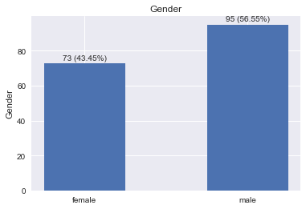


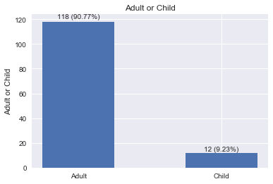


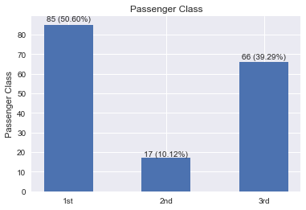


#### Conclusion: Did where they embarked affected their survival rate?

Looking at these charts we can find an explanation! While the proportion of adults vs. children is almost the same as the rest of the passengers, we have a superior proportion of women (43.45% vs. 35.24%). But what most likely led to the passenger who embarked in Cherbourg to have a higher survival rate is the fact that most were 1st Class passengers (50.60% vs. 24.24%).

* We had to drop 2 rows because there were missing values, but I don't think it would've made any difference in the analysis.

## Conclusion Summary

We have encountered many statistical relevant conclusions throughout this analysis, and a few problems with the dataset as well, here's a summary of the conclusions:

* Most people did not survive; the overall survival rate was just 38,4%.
* Most people were male, which is strange, but could be explained if we had more details, in particular, who was a crew member and who was a passenger.
* Of the female passengers, a whopping 74% survived, a fact that is even more interesting if we compare with the male survival rate of just 18%. Again, crew member data could help to explain, at least in part this.
* Children had a higher survival rate than adults (59% vs. 38%), a fact that, together with the previous point and the statistical findings of the 4th question, illustrates a case where the "women and children first" unwritten law worked.
* A less noble statistic found analyzing this data is that members of the 1st and 2nd class had a much higher survival rate than the rest (62% and 47% vs. just 24% for the 3rd class).
* Having family on board boosted the survival rate to 50% vs. just 30% for those alone. This shows us that in disasters like this, having people to count on can really increase our chance of survival!
* A curious finding is that passengers who embarked in Cherbourg had a much higher survival rate than the rest (55%), but this can be explained by the fact that over 50% were 1st in the first class, higher than the average of just 24.2%.

This analysis was interesting because in one hand it showed how selfless the humankind can be in face of a major disaster. But the other side was shown too, members of the upper classes were undoubtedly privileged, maybe it was because their cabins and rooms were closer to the rescue boats, but probably they were prioritized on getting off the ship.

We encountered three major problems with this dataset:


* 177 passengers did not have their age specified, a fact that can put a question mark on some of our findings.
* Nowhere we can find the origin of this data, if it was a survey, was it optional? Or the data came from a manifest signed by everyone while boarding (the best-case scenario, as it is completely unbiased)? Or it was collected when the passengers bought their tickets (maybe the ticket changed hands)? An answer to these questions could put some doubts about the bias of the dataset at ease, and maybe explain why there were so many 'Age' data missing.
* And the missing crew data.

This last point is of particular interest to me. The reason I chose this dataset to analyze was to get an insight on how humans behave in face of a great tragedy, if we turn into selfless heroes, or use our privileges to save ourselves in the expense of others lives. Because of that if I choose to further research this subject, the first thing I'd look for is the crew manifest. It'd be curious to see if the crew members were heroes and saved the passengers first, or if they used their "leadership" position to save themselves, and the true heroes were the passengers.


## References

* Udacity Data Analyst Nanodegree materials
* Udacity Intro to Inferential Statistics materials
* Statistical decision tree: http://www.muhlenberg.edu/media/contentassets/pdf/academics/psychology/stats_decision.pdf
* Effect size: http://www.real-statistics.com/chi-square-and-f-distributions/effect-size-chi-square/
